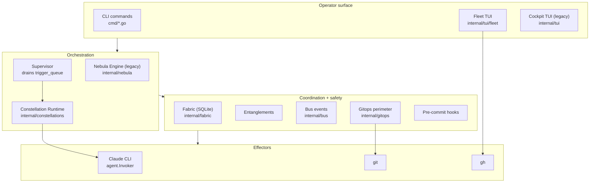

# Quasar Architecture

This is the big-picture map. It explains the four layers Quasar is built from,
what lives in each, and how a unit of work travels from an external signal to a
pull request. Read [docs/glossary.md](glossary.md) first if a term is
unfamiliar; read [docs/README.md](README.md) for the index of deeper documents.

Every `file:line` citation was verified against `main` at write time. Line
numbers drift as code changes — treat them as a starting point, not a contract.

## The four layers

The layers are strictly downward-facing: the operator surface drives
orchestrators, orchestrators read and write the coordination substrate, and
only the effector layer talks to the outside world (the `claude` CLI, `git`,
`gh`). Nothing in a lower layer reaches up.

### Operator surface

How a person interacts with Quasar. There are two terminal UIs and a set of
one-shot CLI commands, all of which send human-readable output to **stderr**
(stdout is reserved for structured data).

- The **fleet TUI** is the primary, multi-repo surface: a three-lane home view
  (awaiting-approval drafts, in-flight runs, recent terminal nebulas) grouped by
  registered repo. The command is the cobra `fleetCmd` at `cmd/fleet.go:33`
  (aliased `quasar tui`); the BubbleTea model is `Model` at
  `internal/tui/fleet/model.go:30`. Approving a draft is the `approve` handler
  at `internal/tui/fleet/model.go:337`, which calls `Store.Approve`
  (`internal/tui/fleet/fleet.go:330`).
- The **cockpit TUI** is the older single-repo browser, retained as a fallback
  during the transition to the fleet view. Its command, `cockpitCmd`, is at
  `cmd/tui.go:26` and is explicitly documented there as legacy.
- The **CLI commands** (`init`, `doctor`, `repo`, `sensor`, `gc`, `lint`,
  `nebula …`) are one file each under `cmd/`.

### Orchestration

There are **two** orchestrators today, and which one runs depends on how work
enters the system.

- The **legacy nebula Engine** (`internal/nebula`) backs `quasar nebula apply`.
  Its `Engine` struct is `internal/nebula/engine_types.go:179` and its lifecycle
  driver is `Engine.Run` at `internal/nebula/engine.go:18` (load → validate →
  branch → plan → apply → execute). Concurrency is handled by the `WorkerGroup`
  at `internal/nebula/worker.go:36`. This path runs in-process and exits when
  the nebula finishes.
- The **constellation Runtime** (`internal/constellations`) is the data-driven
  successor that the fleet view uses. The `Runtime` struct is
  `internal/constellations/runtime.go:60`; it instantiates a run with
  `Runtime.Fire` (`internal/constellations/runtime.go:164`) and advances it one
  node at a time with `Runtime.Step`
  (`internal/constellations/runtime.go:214`). The runtime is driven by the
  **Supervisor** (`internal/constellations/supervisor.go:53`), whose
  `Tick` method (`internal/constellations/supervisor.go:80`) claims pending
  `trigger_queue` rows and fires the named constellation for each.

Both exist because the constellation runtime is the strategic direction (all new
behavior — sensors, multi-repo, master-review — is wired through it) while the
legacy Engine still backs the direct `nebula apply` workflow and its test suite.
Collapsing the Engine into a thin shim over the runtime is a tracked follow-up
(see [CLAUDE.md](../CLAUDE.md) and `docs/runtime.md`, planned in this nebula).

### Coordination + safety

Every shared substrate the orchestrators read and write lives here.

- **Fabric** is the SQLite database, opened by `NewSQLiteFabric` at
  `internal/fabric/sqlite.go:86`. It holds the `nebulas`, `phases`,
  `trigger_queue`, `entanglements`, and blob-registry tables.
- **Entanglements** are the cross-phase symbol-claim lifecycle, driven by the
  `EntanglementStore` at `internal/fabric/entanglement_store.go:22` (declared →
  in-flight → terminal).
- **The bus** is the typed pub/sub event channel decoupling producers from the
  TUI: the `Bus` interface is `internal/bus/bus.go:21` and the `Event` struct is
  `internal/bus/bus.go:127`.
- **The gitops perimeter** confines every git write. The `quasar/*` allowlist
  regex is `internal/gitops/push.go:23`; pushes outside it are rejected before
  `git` is invoked. Pre-commit hooks run inside the worktree as the first step
  of `Commit` (`internal/gitops/commit.go:42`).
- The **`file_claims`** table (`internal/fabric/sqlite.go:41`) is a vestige of
  the pre-constellation coordination model; no runtime path writes to it (noted
  dead in [docs/audit-2026-06-08.md](audit-2026-06-08.md)).

### Effectors

The bottom layer: how a star reaches an LLM and how a commit reaches the
worktree.

- A star's prompt reaches Claude through the `agent.Invoker` interface,
  implemented by the `Invoker` struct at `internal/claude/claude.go:20`. Its
  `Invoke` method (`internal/claude/claude.go:133`) shells out to the `claude`
  CLI as a subprocess and parses the JSON result.
- A diff reaches the repository through `Client.Commit`
  (`internal/gitops/commit.go:42`), which runs pre-commit hooks, stages tracked
  changes, and commits — all through a vanilla `git` binary inside the gitops
  perimeter.

## Flow walkthroughs

Three end-to-end paths, each as numbered steps with the file that does the work.

### 1. A user runs `quasar nebula apply <path>`

The direct, single-repo path through the legacy Engine.

1. The cobra command handler `runNebulaApply` (`cmd/nebula_apply.go:43`) loads
   config and builds a Claude invoker.
2. It constructs the Engine via `nebula.NewEngine` (`cmd/nebula_apply.go:56`).
3. `Engine.Run` (`internal/nebula/engine.go:18`) loads and validates the nebula,
   then creates or checks out the nebula's `quasar/*` branch.
4. The Engine plans the phase DAG and dispatches a `WorkerGroup`
   (`internal/nebula/worker.go:36`) to execute ready phases.
5. Each phase invokes the coder and reviewer through `agent.Invoker`
   (`internal/claude/claude.go:133`).
6. On a green review, the worker commits via `Client.Commit`
   (`internal/gitops/commit.go:42`) and — if pushing — through
   `Client.Push` (`internal/gitops/push.go:57`), which enforces the `quasar/*`
   allowlist (`internal/gitops/push.go:37`).

### 2. A sensor produces a draft nebula

How an external signal becomes an awaiting-approval row in the fleet view.

1. The GitHub sensor's `Poll` (`internal/sensors/github/github.go:124`) shells
   out to `gh`, lists matching issues, and returns one `Event`
   (`internal/sensors/sensors.go:60`) per new issue, advancing its cursor.
2. The scheduler's `PollOnce` (`internal/sensors/scheduler.go:223`) receives the
   events and, for each, calls the sensor's `SeedNebula`
   (`internal/sensors/github/github.go:184`) to render a `SeedNebulaContent`
   (`internal/sensors/sensors.go:66`).
3. The scheduler's `seed` (`internal/sensors/scheduler.go:294`) inserts the
   content as a draft row through the `NebulaInserter`
   (`internal/sensors/scheduler.go:299`), writing into the `nebulas` table with
   an awaiting-approval status.
4. The fleet view loads that row into its **awaiting-approval** lane the next
   time its model refreshes (`internal/tui/fleet/model.go:30`).

### 3. An operator approves a nebula from the fleet view

How approval becomes a pull request. Note the first constellation fired is the
**architect** (which builds the phases), not coder-reviewer directly.

1. The operator presses `a`; the fleet model's `approve`
   (`internal/tui/fleet/model.go:337`) calls `Store.Approve`
   (`internal/tui/fleet/fleet.go:330`), which — in one transaction — flips the
   nebula to `approved` and inserts a `trigger_queue` row naming the `architect`
   constellation, carrying the nebula's `repo_path`.
2. The fleet's background supervisor `Tick`
   (`internal/constellations/supervisor.go:80`) claims that pending row and
   calls its `Firer`.
3. The `Firer` is the `RuntimeCacheFirer`
   (`internal/constellations/runtime_cache.go:137`), which resolves the
   per-repo `Runtime` and calls `Runtime.Fire`
   (`internal/constellations/runtime.go:164`) to instantiate the architect run.
4. The architect run decomposes the draft into phases; each phase is driven
   through the **coder-reviewer constellation**
   (`internal/artifacts/defaults/constellations/coder-reviewer.toml`): the coder
   writes a diff, the runtime commits it (`internal/gitops/commit.go:42`), and
   the reviewer's verdict is parsed by `opReviewerDecision`
   (`internal/constellations/reviewer_decision.go:40`), revising up to
   `[meta].max_cycles`.
5. The completed nebula is judged by the **master-review constellation**
   (`internal/artifacts/defaults/constellations/master-review.toml`). A `fix`
   verdict dispatches coder-reviewer as a nested run via
   `Runtime.dispatchConstellation`
   (`internal/constellations/dispatch_constellation.go:26`); a back-edge to
   `review` re-judges the fix, bounded by `[meta].max_cycles`.
6. On `ship`, the branch is pushed (`internal/gitops/push.go:57`) and a pull
   request is opened (via the `open-pr` constellation and the `gh` CLI).

## See also

- [docs/safety.md](safety.md) — the gitops perimeter, token scopes, and what
  Quasar can and cannot do.
- [docs/glossary.md](glossary.md) — every term above, tied to its code location.
- `docs/runtime.md`, `docs/constellations.md`, `docs/fabric.md`,
  `docs/multi-repo.md`, `docs/entanglements.md` — per-subsystem deep dives
  (planned in this nebula).
