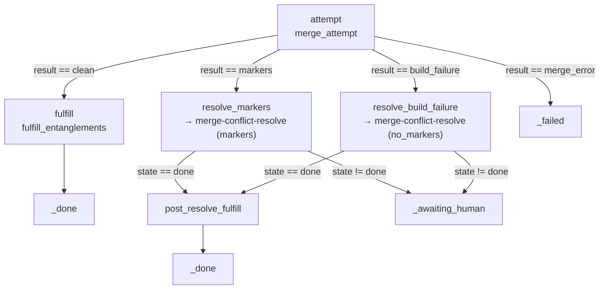

# Conflict resolution

When two phases run in parallel, each coder works in its own git worktree, so
neither can corrupt the other's tree in place. The collision surfaces only at
**integration**, when one branch is merged into the other. The conflict-
resolution subsystem turns that collision into a *routed recovery*: a merge gate
classifies the outcome, and a dedicated conflict-resolver star reconciles both
workstreams' intent — or escalates to a human when reconciliation is unsafe.

> `file:line` citations were verified against `main` at write time and may drift
> as the code changes.

> **Status note.** The merge gate ships today as a fully-built, unit-tested set
> of builtins and an *authoring-reference* constellation. The supervisor that
> would *fire* the gate automatically after a phase reaches `_done` is deferred
> (`internal/artifacts/defaults/constellations/merge-gate.toml:4-14`). This doc
> describes the wired-and-tested machinery and flags the deferred firing edge
> where it matters.

Related reading: [entanglements.md](entanglements.md) (the symbol state the
resolver reads), [safety.md](safety.md) (the gitops perimeter the worktree obeys),
[runtime.md](runtime.md) (the constellation engine), and the
[architecture overview](architecture.md).

## 1. Why conflicts happen

Parallel coders write into separate worktrees that may touch overlapping scope.
Worktree isolation prevents *in-place* corruption — the main working tree is
never modified by an attempt. The merge gate is what catches the collision when
the branches are finally integrated. [Entanglements](entanglements.md) make
collisions *rare* by warning coders of sibling intent up front; the merge gate is
the *authoritative* backstop when the advisory layer was not enough.

## 2. The merge gate

The gate is the `merge_attempt` builtin (`opMergeAttempt`,
`internal/constellations/operators_merge.go:51`) plus the `merge-gate`
constellation (`internal/artifacts/defaults/constellations/merge-gate.toml`). It
merges the run's branch into its parent in a throwaway worktree, classifies the
result, and routes on it.



There are four classified outcomes (`MergeResult`,
`internal/gitops/merge_attempt.go:21-33`); the constellation routes on the first
three (`merge-gate.toml:65-83`):

| `result` | Meaning | Routes to |
|----------|---------|-----------|
| `clean` | no markers, verify passed | `fulfill` → `_done` |
| `markers` | git left `<<<<<<<` conflict markers | `resolve_markers` (resolver, `markers` mode) |
| `build_failure` | marker-free merge, but the verify command failed — a semantic collision | `resolve_build_failure` (resolver, `no_markers` mode) |
| `merge_error` | git merge itself failed (missing ref, corrupt object) | `_failed` |

On a `markers` or `build_failure` outcome the operator keeps the merge worktree
(`KeepWorktree: true`, `operators_merge.go:70-77`) so the downstream resolver
inherits the exact merge state; it cleans up itself only for `clean`/`merge_error`
(`operators_merge.go:89-91`). The clean path fulfills the producing run's
[entanglements](entanglements.md) via `fulfill_entanglements`
(`opFulfillEntanglements`, `operators_merge.go:135`).

## 3. `MergeAttempt.Try`

The git-level work lives in `MergeAttempt.Try`
(`internal/gitops/merge_attempt.go:85`). It:

1. Computes a deterministic worktree path under the repo's git common dir
   (`<git-common-dir>/quasar-merge/merge-<run-id>/`, `worktreePath`,
   `merge_attempt.go:163`), invisible to the main working tree.
2. Adds a detached worktree at the destination branch
   (`merge_attempt.go:103`); a failure here is classified `merge_error`, not a
   Go error, so the constellation can route it (`merge_attempt.go:103-109`).
3. Runs `git merge --no-edit <src>` (`merge_attempt.go:116`). Unmerged paths →
   `markers` with the conflicted file list (`conflictedFiles`,
   `merge_attempt.go:215`); a failed merge with no unmerged paths → `merge_error`.
4. On a clean merge, captures the merge SHA and runs the **verify command**
   against the merged tree. The default is
   `go build ./... && go test -short ./...` (`DefaultVerifyCommand`,
   `merge_attempt.go:16`); a repo overrides it via its `.quasar.yaml`
   `[merge_gate]` block. A non-zero verify → `build_failure`
   (`merge_attempt.go:148-153`).

### Verify-timeout safety

A naive `exec.CommandContext` + `CombinedOutput` has a subtle hang: `ctx.Done`
SIGKILLs `sh`, but children `sh` spawned (a wedged `go test`) inherit the pipes
and keep them open, so the pipe-drain wait blocks forever even though the timeout
fired. `runVerify` (`internal/gitops/merge_attempt.go:247`) fixes this with three
mechanisms (documented in the function's own comment, `merge_attempt.go:235-246`):

- **`Setsid`** puts the verify subprocess in its own session/process group
  (`verifySysProcAttr`, `internal/gitops/verify_attr_unix.go`) so the whole
  subtree can be killed.
- **A group kill** on cancel (`killVerifyGroup`, negative-PID SIGKILL) reaps the
  children (`merge_attempt.go:256-262`).
- **`WaitDelay = 2s`** caps the post-kill pipe-drain as a backstop
  (`merge_attempt.go:263`).

This is the bug noted in the [2026-06-08 audit](audit-2026-06-08.md) session log
("Fix verify subprocess timeout blocking bug with orphaned children").

> **Deferred edge:** on a `clean` outcome the merge commit is reachable only from
> the throwaway worktree's detached HEAD. Removing the worktree unanchors the SHA
> and makes it GC-eligible. The (deferred) firing supervisor must anchor
> `merged_sha` before cleanup — keep the worktree until the parent commit lands,
> or `git update-ref refs/quasar/merge-<run-id> <sha>`. The caveat is documented
> in place at `merge_attempt.go:131-136` and `operators_merge.go:81-88`.

## 4. The conflict-resolver star

When the gate routes to a resolver, it runs the `conflict-resolver` star
(`internal/artifacts/defaults/stars/conflict-resolver.md`). Its frontmatter
(`conflict-resolver.md:1-39`):

- **Model:** `claude-haiku-4-5` (haiku-class), with `claude-sonnet-4-6` as
  fallback (`:3-4`). A narrow reconciliation task does not need a frontier model.
- **Narrow tool allowlist:** `Read`, `Edit`, and read-only `git`/`go` Bash
  (`status`, `diff`, `build`, `vet`, `test -short`) — `:8-16`. It explicitly
  **denies** `Write`, `git push/commit/merge/reset/checkout` (`:17-24`): the
  resolver may only Edit files that already carry markers or build errors; it
  never creates files or mutates refs.
- **Budget-bounded:** `max_budget_usd = 5.00`, `effort = "high"` (`:26-30`).
- **Truncation disabled** for its structured result, because the output is a
  single JSON object consumed whole and byte-truncation would corrupt it
  (`:32-38`).

The prompt instructs it to read the assembled context in order — Workstream A's
spec+diff, Workstream B's spec+diff, the entanglement state, and the conflict
signal — and to **preserve both intents** rather than pick a winner
(`conflict-resolver.md:41-61`). Its output is a single
`conflict-resolution-result-v1` JSON object (`:63-78`).

The resolver runs inside the `merge-conflict-resolve` constellation
(`internal/artifacts/defaults/constellations/merge-conflict-resolve.toml`): a
`render → resolve → decide` loop with a `decide → render` back-edge that retries
up to `[meta].max_cycles = 2` (`merge-conflict-resolve.toml:10-11`,
`:80-83`). Each back-edge is one cycle, counted by the same runtime back-edge
counter every loop uses — no special-casing. Beyond the cap (or on a
`needs_human` verdict) it routes to `give_up` → `_awaiting_human`
(`merge-conflict-resolve.toml:99-110`).

## 5. The two modes

Both collision kinds run through the *same* star but a different rubric section.
The modes are constants (`internal/constellations/operators_conflict.go:28-31`):

| Mode | Constant | Trigger | Signal carried |
|------|----------|---------|----------------|
| `markers` | `conflictModeMarkers` (`:29`) | literal `<<<<<<<` blocks in files | the conflicted file list |
| `no_markers` | `conflictModeNoMarkers` (`:30`) | a marker-free merge whose build failed (semantic conflict) | the build error output |

The `render_conflict_context` builtin validates the mode and errors on anything
else (`operators_conflict.go:94-98`). The matching rubric lives in the
`conflict-resolution-rules` skill
(`internal/artifacts/defaults/skills/conflict-resolution-rules.md`):

- **Markers mode** (`:5-21`): both sides appended to a list → keep both in
  source order; both modified the same line → prefer the version matching the
  producer's declared signature in the entanglement state; imports diverged →
  union+sort+dedupe; delete-vs-modify → **STOP**; config-file conflict → **STOP**.
- **No-markers mode** (`:23-42`): `undefined: Foo` → check whether Foo's
  entanglement is `deprecated` (migrate to the replacement) or `in_flight` with a
  new signature (update the consumer); `not enough arguments` → signature
  evolved, update call sites; multiple unrelated errors → **STOP**.
- **Universal rules** (`:44-52`): never add functionality, never reintroduce a
  `deprecated` symbol, and if a pass makes the build *worse*, STOP.

## 6. The `render_conflict_context` builtin

Before the resolver runs, `opRenderConflictContext`
(`internal/constellations/operators_conflict.go:93`) assembles a single markdown
block. It builds a `workstream` for each side via `buildWorkstream`
(`operators_conflict.go:112`) — run/phase id, title, the spec's Problem and
Solution, the diff — and attaches that side's active entanglements via
`entanglementsFor` (`operators_conflict.go:130`, which reads `ActiveAll` and
filters by run/phase). `renderConflictContext` (`operators_conflict.go:157`)
stitches both workstreams plus the collision signal into the block.

A rendered block (abbreviated) looks like:

```markdown
## Workstream A (run r-101, phase 01-fix-truncate, "Fix TruncateMiddle")
### Spec — Problem
TruncateMiddle drops the wrong half on odd lengths.
### Spec — Solution
Reslice around the midpoint…
### Diff against base
```diff
-func TruncateMiddle(s string, n int) string {
+func TruncateMiddle(s string, max int) string {
```
### Entanglements emitted by A
- TruncateMiddle (function, in_flight, signature="func TruncateMiddle(s string, max int) string")

## Workstream B (run r-102, phase 04-mixed-review, "Add review test")
…

## How they collided
- Mode: markers
- Conflicted files: internal/ui/truncate.go

## What you must do
1. Preserve A's intent for the modified contract
2. Preserve B's intent for the consumer code
3. Reconcile the contract between them per the conflict-resolution-rules skill — do not pick a winner
```

When a workstream's spec/diff is not supplied (those `src_*`/`dst_*` inputs are
threaded by the deferred firing supervisor), the renderer degrades to
`(not provided)` rather than failing (`operators_conflict.go:90-92`,
`renderWorkstream`, `:181`), so the resolver always gets at least the collision
signal and any recorded entanglements.

## 7. Escalation rules

Some collisions are never safe to auto-resolve. `conflict_resolution_decision`
(`opConflictResolutionDecision`,
`internal/constellations/operators_conflict.go:233`) applies **universal
escalation guards before it even parses the resolver's output**
(`operators_conflict.go:234-236`), so a malformed or over-confident resolver
payload cannot override them. The guard logic is `escalationReason`
(`operators_conflict.go:253`):

- **Config-file conflicts** — any conflicted file whose basename is in
  `configFileBasenames` (`.quasar.yaml`, `nebula.toml`, `go.mod`, `go.sum`,
  `package.json`, `cargo.toml`, `pyproject.toml`, `tsconfig.json`, …;
  `operators_conflict.go:37-50`) → immediate `needs_human`.
- **Delete-vs-modify on protected paths** — a delete-vs-modify collision under a
  `protectedPathPrefixes` root (`internal/`, `cmd/`,
  `operators_conflict.go:52-55`) → immediate `needs_human`.

These short-circuit to `needs_human` with a structured reason and `files_changed
= 0` (`conflictDecisionOutput`, `operators_conflict.go:342`) — without consuming
a resolve cycle, since the guard fires ahead of the resolver invocation. Repeated
failure is bounded by the constellation's `max_cycles = 2` cap, after which the
run escalates to `_awaiting_human`.

## 8. Telemetry

Every resolution run records one outcome row through the `emit_conflict_telemetry`
builtin (`opEmitConflictTelemetry`,
`internal/constellations/operators_conflict_telemetry.go:33`), placed as a
terminal node that the retry back-edge bypasses so a retried cycle is never
double-counted (`merge-conflict-resolve.toml:41-51`, `:80-90`). The row is a
`ConflictResolutionEvent` (`internal/telemetry/conflict_resolutions.go:14`),
appended as one JSON line to `.quasar/telemetry/conflict_resolutions.jsonl`
(`cmd/conflicts.go:15`). Telemetry is a non-fatal side channel: a record failure
is logged to stderr and never aborts a successfully-resolved merge
(`operators_conflict_telemetry.go:43-46`).

**`quasar conflicts report`** exists and is implemented
(`cmd/conflicts.go:22-38`, handler `runConflictsReport`, `:40`). It walks the log
over a `--since` window (default 7 days, `:35`) and prints the resolution rate,
average cost and latency per resolution, and the files most often involved in
conflicts (`:59-70`) — a signal for where the codebase has structural
cross-cutting concerns.

## See also

- [entanglements.md](entanglements.md) — the symbol-lifecycle state the resolver
  reads and the advisory layer that makes conflicts rare.
- [runtime.md](runtime.md) — back-edges, cycle counting, and nested-constellation
  dispatch (how `merge-gate` calls `merge-conflict-resolve`).
- [safety.md](safety.md) — the gitops perimeter the merge worktree and the
  resolver's denied tools obey.
- [multi-repo.md](multi-repo.md) — how parallel runs that collide are scheduled
  per repo.
- [audit-2026-06-08.md](audit-2026-06-08.md) — the verify-timeout bug history.
