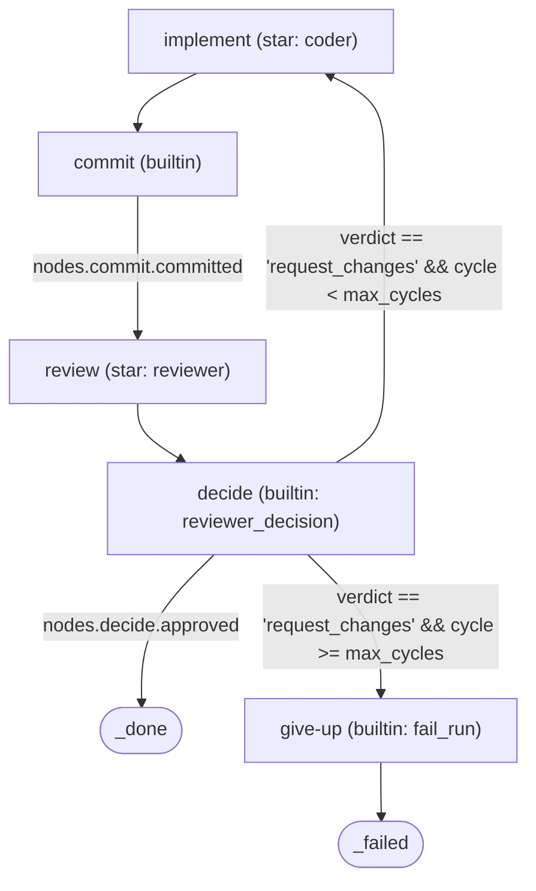
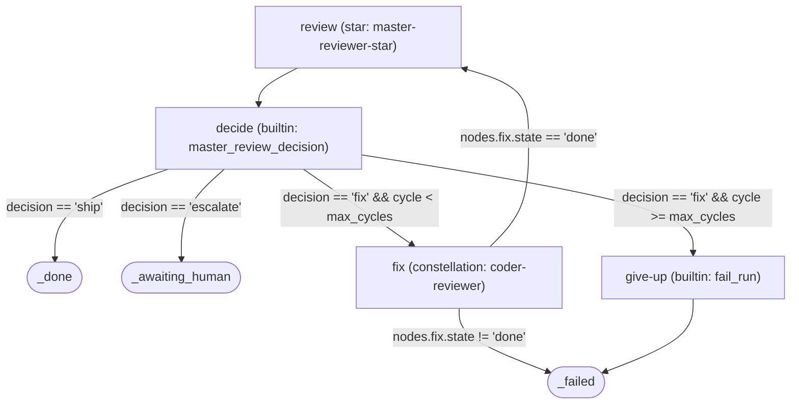

# Constellations — the declarative workflow surface

A **constellation** is Quasar's unit of orchestration: a parsed TOML DAG of typed
nodes wired together by edges, where each edge carries an optional `when:` guard
evaluated by a small expression mini-language. Constellations are *declarative* —
loop bounds, routing, and cycle caps live in the TOML, not in Go constants — so
changing a workflow means editing a `.toml` file, not recompiling.

This document covers what a constellation is, the four node types, the star and
skill formats nodes compose from, the expression language the edge guards speak,
and a walk through every constellation Quasar ships. For how the runtime
*executes* a constellation (Fire → Step → terminate, budget, persistence,
supervisor), see [runtime.md](runtime.md). For where run state is stored, see
[fabric.md](fabric.md). For the layered system picture, see
[architecture.md](architecture.md); for terms, [glossary.md](glossary.md).

---

## 1. What a constellation is

The loaded, ready-to-execute form is `artifacts.Constellation`
(`internal/artifacts/types.go:133-145`):

```go
type Constellation struct {
	Name        string
	Description string
	Meta        map[string]any        // the [meta] table: max_cycles, etc.
	Nodes       []ConstellationNode
	Edges       []ConstellationEdge
	Outputs     map[string]Expression // exposed to a parent constellation
	SourcePath  string
}
```

- **`Nodes`** are the work units (`ConstellationNode`, `types.go:149-156`). Each
  has an `ID`, a `Type`, exactly one of `Star`/`Ref`/`Op` (selected by `Type`),
  and an `Inputs` map of *pre-compiled* expression templates.
- **`Edges`** are directed transitions (`ConstellationEdge`, `types.go:161-165`).
  `When` is `nil` for an unconditional edge; otherwise it must evaluate truthy
  for the runtime to follow the edge. `To` is either a node ID or a reserved
  terminal target.
- **`Meta`** is an untyped `map[string]any` (`types.go:136-140`) holding
  operator-tunable scalars — most importantly `max_cycles`. Keeping it untyped
  means new `[meta]` keys need no loader change; the runtime coerces the ones it
  understands. The cycle cap is resolved at Fire time and surfaced to edge guards
  as `meta.max_cycles` — **there is no Go constant for any loop limit** (see
  [runtime.md §6](runtime.md#6-cycle-counting-and-back-edges)).
- **`Outputs`** are expression templates a child constellation exposes back to
  its parent (used by nested dispatch — see [§6](#6-the-default-constellations)).

Reserved **terminal targets** are recognized by the runtime rather than declared
as nodes (`types.go:23-39`): `_done`, `_failed`, `_awaiting_human`, `_paused`.
`IsTerminal` (`types.go:32-39`) is what cycle detection and unknown-node checks
use to exempt them.

A constellation is parsed and compiled once, at load time, by
`Loader.LoadConstellation` (`internal/artifacts/loader.go:157-214`): node input
templates and edge guards are compiled to `Expression` ASTs there
(`loader.go:180`, `loader.go:197`) so the runtime never re-parses during a walk.

---

## 2. The four node types

A node's `Type` field (`NodeType`, `types.go:8-18`) selects what the runtime does
when it reaches that node. The dispatch switch lives in `Runtime.dispatch`
(`internal/constellations/runtime.go:283-303`).

| Type | Constant | What runs | Defined in | Dispatch site | Outputs shape |
|---|---|---|---|---|---|
| `star` | `NodeStar` | an LLM agent | `internal/artifacts/defaults/stars/*.md` | `runtime.go:294-295` → `dispatchStar` | `{result, cost_usd, session_id}` (`dispatch_star.go:106-110`) |
| `builtin` | `NodeBuiltin` | a Go operator | `internal/constellations/operators*.go` | `runtime.go:285-293` → `dispatchBuiltin` | per-operator map |
| `constellation` | `NodeConstellation` | a child constellation, run synchronously | TOML `ref = "..."` | `runtime.go:296-297` → `dispatchConstellation` | `{state, run_id, <child outputs>}` (`dispatch_constellation.go:81-93`) |
| `phase_iterator` | `NodePhaseIterator` | a sub-constellation fanned over the nebula's phases | TOML `inputs.sub_constellation` | `runtime.go:298-299` → `dispatchPhaseIterator` | `{all_phases_complete, phases_executed}` |

When the `type` field is omitted, the loader infers it from whichever of
`star`/`ref`/`op` is populated (`nodeTypeOf`, `loader.go:287-305`).

A node's `Type` is the only place the directory-as-discriminator principle stops:
a file is a *star* because it lives in `stars/` and a *constellation* because it
lives in `constellations/`, but *inside* a constellation the node's `type` field
selects behavior (`types.go:5-7`).

---

## 3. Stars

A **star** is a fully-resolved agent definition: a model, its tool allow/deny
lists, per-invocation defaults, health and checkpoint policy, and a prompt. The
loaded form is `artifacts.Star` (`types.go:46-65`). Stars are authored as
Markdown files with a `+++`-delimited TOML frontmatter block.

### Walkthrough: `coder.md`

`internal/artifacts/defaults/stars/coder.md`:

```toml
+++
name = "coder"                         # line 2
model = "claude-sonnet-4-6"            # line 3
fallback_model = "claude-haiku-4-5"    # line 4
skills = ["git-aware", "prompt-cache-aware"]   # line 10

[tools]                                # line 12
allowed = ["Read", "Edit", "Write", "Glob", "Grep", "Bash(go *)", "Bash(git diff *)", "Bash(git status)"]
denied  = ["Bash(git push *)", "Bash(gh pr merge *)", "Bash(git reset *)", "Bash(git commit *)", "Bash(git add *)"]

[defaults]                             # line 16
max_budget_usd = 0.50
effort = "medium"

[context_budget]                       # line 34
max_reads_before_edit = 8
max_greps_before_edit = 6
max_total_reads = 30
tool_result_max_bytes = 16384
include_sibling_phases = false
enable_tool_hook = false

[health]                               # line 50
wall_clock_cap = "25m"
file_write_idle_cap = "5m"
token_rate_floor = 5
cpu_idle_cap = "90s"
+++

You are the coder. Implement the task...   # the Markdown body becomes Star.Prompt
```

Field-by-field (decode target: `starFrontmatter`, `loader.go:341-384`):

- **`name` / `model` / `fallback_model`** — identity and the model pair the
  invoker uses (`coder.md:2-4`). `fallback_model` is tried if the primary fails.
- **`skills`** — names resolved transitively at load time (`coder.md:10`); see
  [§4](#4-skills).
- **`[tools]` `allowed` / `denied`** — the tool permission policy
  (`StarTools`, `types.go:108-112`). Note the coder is *denied* every git-write
  command (`coder.md:14`): this enforces the runtime-owns-commits invariant from
  the authoring side (see [runtime.md §4](runtime.md#4-dispatchstar--the-safety-invariant)
  and [safety.md](safety.md)).
- **`[defaults]`** — `max_budget_usd` and `effort` applied per invocation
  (`StarDefaults`, `types.go:114-118`).
- **`[context_budget]`** — bounds on how much context one invocation consumes
  (`StarContextBudget`, `types.go:94-106`); the invoker honors it via
  `contextBudget` (`dispatch_star.go:195-213`).
- **`[health]`** — overrides for the dead-coder healthcheck thresholds
  (`StarHealthPolicy`, `types.go:71-79`); honored via `contextHealth`
  (`dispatch_star.go:220-231`). See [runtime.md §10](runtime.md#10-the-healthcheck-and-dead-coder-detection).
- **`[checkpoint]` `enabled`** and **`coordination_aware`** — both pointer-typed
  so an absent key defaults to `true` (`loader.go:92`, `loader.go:378-383`):
  checkpointing and coordination are opt-*out* for coder-class stars.

### Skill composition: `Tools.Allowed = base ∪ each skill's tools_add`

`LoadStar` (`loader.go:50-98`) decodes the frontmatter, then calls
`resolveSkills` (`loader.go:103-126`). For each referenced skill it:

1. prepends the skill's prompt fragment ahead of the star body, in declaration
   order (`loader.go:114-124`); and
2. unions the skill's `tools_add` into `Tools.Allowed` via `unionStrings`
   (`loader.go:117`, `unionStrings` at `loader.go:326-337` — an order-preserving,
   de-duplicated union).

So the coder's effective allowlist is its base `[tools].allowed` plus
`git-aware`'s `tools_add` (`prompt-cache-aware` adds none).

---

## 4. Skills

A **skill** is a reusable prompt fragment plus the tools it grants
(`artifacts.Skill`, `types.go:123-128`). Skills are how cross-cutting capability
(git access, cache awareness, a review rubric) is shared across stars without
copy-pasting prompt text or tool lists. They live in
`internal/artifacts/defaults/skills/`: `git-aware.md`, `prompt-cache-aware.md`,
plus rubric/rules skills the reviewer and conflict-resolver stars compose.

Format — same `+++` frontmatter as a star, decoded into `skillFrontmatter`
(`loader.go:386-389`), with just two keys. Example, `git-aware.md`:

```toml
+++
name = "git-aware"
tools_add = [
  "Bash(git diff *)",
  "Bash(git log *)",
  "Bash(git status)",
  "Bash(git ls-files *)",
]
+++

You have git access for inspection... Do not commit, stage, or otherwise
write to git. In Quasar the runtime owns the commit step...
```

`LoadSkill` (`loader.go:130-152`) parses it; composition into the star happens in
`resolveSkills` as described in [§3](#3-stars). The Markdown body becomes
`PromptFragment`; `tools_add` becomes `ToolsAdd`.

---

## 5. Edge guards and the expression mini-language

Edge `when:` guards, node `inputs`, and constellation `outputs` are all written in
a small expression language compiled to an `Expression` AST
(`internal/artifacts/expr.go:12-18`). Two entry points compile source:

- **`Parse`** (`expr.go:58-73`) — a *bare* expression, used for edge `when`
  guards. It lexes, runs a precedence-climbing parser
  (`internal/artifacts/expr_parse.go`), and rejects trailing tokens.
- **`ParseTemplate`** (`expr.go:80-115`) — a *string interpolation* template,
  used for node inputs and outputs. A value that is exactly `${expr}` evaluates to
  the raw, type-preserving value of `expr`; a mix of literal text and `${...}`
  segments evaluates to their concatenated string forms; a string with no `${` is
  a constant literal.

### Constructs

| Construct | Implemented by | Notes |
|---|---|---|
| `dot.access` | `State.Get` (`expr.go:28-41`), `varExpr` (`expr.go:129-132`) | Walks nested maps; **a missing segment yields `nil` (falsy), never an error** — so a guard on a not-yet-produced node is simply false. |
| `==`, `!=` | `looseEqual` (`expr_eval.go:50-53, 65-84`) | Numbers compare across int/float; mismatched types are unequal. |
| `<`, `<=`, `>`, `>=` | `compare` (`expr_eval.go:54-55, 88-104`) | Non-numbers compare false rather than erroring. |
| `&&`, `\|\|` | `binaryExpr.Eval` (`expr.go:160-194`) | Short-circuit boolean operators. |
| `!` (unary) | `unaryExpr.Eval` (`expr.go:139-152`) | Logical negation; also unary minus for numbers. |
| ternary `cond ? a : b` | `ternaryExpr.Eval` (`expr.go:199-213`) | Right-associative. |
| `${...}` interpolation | `interpolationExpr.Eval` (`expr.go:239-253`) | Joins literal text and evaluated segments. |
| `+ - * /` | `arithmetic` (`expr_eval.go:107-133`) | `+` also concatenates two strings; divide-by-zero is the one hard error. |

### The tiny stdlib

Exactly three functions are callable, evaluated by `evalCall`
(`expr_eval.go:137-175`); the parser rejects any other name at compile time:

- **`len(x)`** — element/character count of a string, slice, or map
  (`expr_eval.go:148-152`, via `lengthOf` at `expr_eval.go:179-196`).
- **`empty(x)`** — `len(x) == 0` (`expr_eval.go:153-157`).
- **`has(map, key)`** — key-presence test (`expr_eval.go:158-171`).

> The expression language has no coalesce operator and no `default()` function.
> Where a default-on-empty is needed, authors use an `empty(x) ? fallback : x`
> ternary — exactly what `merge-gate.toml:63` does to pick whichever resolver
> ran.

### A real expression, broken down

From `coder-reviewer.toml:80`, the edge that loops back to revise:

```
nodes.decide.verdict == 'request_changes' && cycle < meta.max_cycles
```

- `nodes.decide.verdict` — dot-access into the `decide` node's recorded output
  (`varExpr` → `State.Get`); resolves to the reviewer's verdict string.
- `== 'request_changes'` — string equality (`looseEqual`).
- `cycle < meta.max_cycles` — ordering comparison (`compare`) of the run's
  back-edge counter against the declarative cap.
- `&&` — short-circuit AND (`binaryExpr.Eval`): both must hold, so the loop
  re-enters only while the reviewer wants changes *and* the cycle budget remains.

`cycle` and `meta.max_cycles` are surfaced into the evaluation namespace by
`State.ExprState` (`internal/constellations/state.go:147-190`).

---

## 6. The default constellations

All embedded defaults live in
`internal/artifacts/defaults/constellations/`. A repo can override any of them
(see [§7](#7-authoring-a-constellation-override)).

### coder-reviewer — the inner loop

`coder-reviewer.toml`. The coder writes a diff, the runtime commits it, the
reviewer judges it, and a back-edge revises up to `[meta].max_cycles` (default 3,
`coder-reviewer.toml:10-11`) before the run fails. The `commit` builtin — never
the coder star — owns the git write (`coder-reviewer.toml:23-32`).



The `decide → implement` edge (`coder-reviewer.toml:77-80`) targets an
earlier-declared node, so the runtime counts it as a back-edge and increments
`cycle`; once `cycle >= meta.max_cycles` the give-up edge
(`coder-reviewer.toml:82-85`) wins and the run fails rather than shipping
unreviewed work. The cap is enforced purely by the positional back-edge counter —
no special-casing (`internal/constellations/walk.go:69-78`).

### master-review — the outer loop with a nested inner loop

`master-review.toml`. Reviews a completed nebula's full diff and decides ship vs
spawn-fix vs escalate. A `fix` verdict within cap dispatches the **coder-reviewer
constellation as a child run** (`master-review.toml:36-40`, `type = "constellation"`,
`ref = "coder-reviewer"`); the unconditional back-edge `fix → review`
(`master-review.toml:80-83`) re-judges the freshly-applied fix and increments the
outer `cycle`. `meta.max_cycles` defaults to 3 (`master-review.toml:9-10`).



> **History:** this nested wiring landed in the 2026-06-08 audit. Older docs may
> describe a PLACEHOLDER that routed within-cap fixes straight to
> `_awaiting_human`; that placeholder is gone, replaced by real synchronous
> dispatch (`internal/constellations/dispatch_constellation.go:13-18`). See
> [audit-2026-06-08.md](audit-2026-06-08.md).

### The other shipped constellations

- **architect** (`architect.toml`) — refines a seed nebula into executable
  phases. `render_seed` (builtin) → `plan` (architect-star) → `persist`
  (`persist_phases` builtin) → `_done`. Triggered by sensors after operator
  approval.
- **architect-fix** (`architect-fix.toml`) — same shape as architect, but
  `render_fix` turns master-review fix feedback into *additional* phases appended
  to the nebula, which the phase iterator then picks up.
- **open-pr** (`open-pr.toml`) — the terminal happy-path step: `push`
  (`gitops_push` builtin) → `create_pr` (`gh_open_pr` builtin) → `_done`.
- **nebula-lifecycle** (`nebula-lifecycle.toml`) — the top-level orchestrator:
  `execute_phases` (a `phase_iterator` fanning `coder-reviewer` over every phase)
  → `master_review` (nested constellation) → ship (`open-pr`) on `decision == 'ship'`,
  or `fix` (`architect-fix`) which back-edges to `execute_phases`, or
  `_awaiting_human` on escalate / exhausted fix cycles.
- **merge-gate** (`merge-gate.toml`) — attempts a cross-phase merge
  (`merge_attempt` builtin), classifies the outcome
  (clean / markers / build_failure / merge_error), and routes clean merges to
  `fulfill_entanglements` or conflicts to the resolver sub-constellation. Marked
  FORWARD-LOOKING: the firing supervisor that threads `run_id` / verify config is
  a tracked follow-up (`merge-gate.toml:4-14`).
- **merge-conflict-resolve** (`merge-conflict-resolve.toml`) — a
  render → resolve (conflict-resolver star) → decide loop, capped at
  `[meta].max_cycles = 2` (`merge-conflict-resolve.toml:10-11`), that commits a
  green resolution or escalates to `_awaiting_human`. Every terminal pass flows
  through an `emit_conflict_telemetry` node exactly once; the retry back-edge
  bypasses it so a retried cycle is never double-counted
  (`merge-conflict-resolve.toml:41-51, 76-90`).

---

## 7. Authoring a constellation override

The loader resolves artifacts through a `PathResolver`
(`internal/artifacts/loader_resolve.go`). For any artifact it first asks the
resolver for a per-repo path; the embedded default is used only when the resolver
returns the `:embedded:` sentinel. `Loader.read`
(`internal/artifacts/loader_resolve.go`) is the single place this fallback
happens: an embedded path reads from the `defaults/` embed FS, any other path is
an `os.ReadFile` of the per-repo file.

In practice: drop a file at `<repo>/constellations/<name>.toml` and it shadows the
embedded `defaults/constellations/<name>.toml` of the same name —
`LoadConstellation` (`loader.go:157-158`) reads through the resolver, so the
override is picked up with no code change. The same mechanism works for
`<repo>/stars/<name>.md` and `<repo>/skills/<name>.md`. See
[per-repo-config.md](per-repo-config.md) for the full override-directory layout.

Because `[meta].max_cycles` is read from the TOML, an override that only needs to
change a loop bound can be a one-line edit; a nebula's
`[execution].max_review_cycles` overrides it per run without touching the file at
all (see [runtime.md §6](runtime.md#6-cycle-counting-and-back-edges)).
