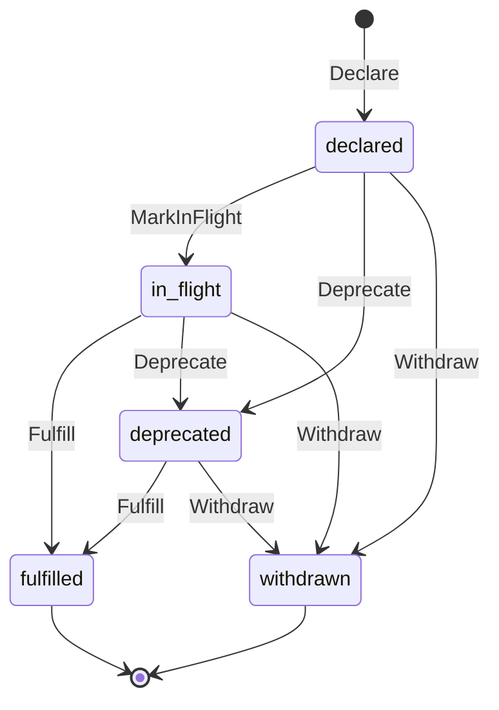
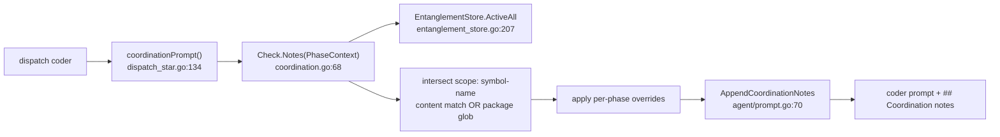

# Entanglements

An **entanglement** is a producer's typed declaration that it intends to
produce, modify, or remove a named symbol (a function, type, interface, …).
When several phases run in parallel, each phase's coder works in its own
worktree and cannot see the others' uncommitted edits. Entanglements are the
shared, durable record of "who is touching what," so a coder about to use a
symbol can be warned that a sibling is mid-flight on it, or has already removed
it.

Entanglements are **advisory coordination**, not a lock. They never block a
coder. The authoritative backstop against two phases genuinely colliding is the
[merge gate](conflict-resolution.md), which catches the collision at
integration time. Entanglements exist to make that collision *rare* by feeding
each coder the siblings' current intent before it writes code.

> `file:line` citations were verified against `main` at write time and may drift
> as the code changes.

Related reading: [fabric.md](fabric.md) (the table this lives in),
[runtime.md](runtime.md) (where the transitions fire),
[conflict-resolution.md](conflict-resolution.md) (the hard backstop), and the
[architecture overview](architecture.md).

## 1. The model

A symbol's identity is the triple `(producer, kind, name)` — enforced by a
`UNIQUE(producer, kind, name)` constraint on the table. Each symbol carries a
lifecycle **status** plus time-anchored bookkeeping columns (`declared_at`,
`in_flight_at`, `terminated_at`, `current_signature`) so the TUI can render
"declared 4m ago by phase X" and the coordination pre-flight can rank competing
intents by recency.

The store that drives the lifecycle is `EntanglementStore`
(`internal/fabric/entanglement_store.go:22`), constructed with
`NewEntanglementStore` (`internal/fabric/entanglement_store.go:27`). It is the
single typed API over the table; the runtime never writes the `status` column by
hand.

## 2. The five-state lifecycle

The production lifecycle has **exactly five** states. The status string
constants are defined together in `internal/fabric/fabric.go:47-58`:



| Status | Constant (`fabric.go`) | Meaning | Terminal? |
|--------|------------------------|---------|-----------|
| `declared` | `StatusDeclared` (`:53`) | The architect parsed the spec and detected the symbol; no code touches it yet. `run_id` is still NULL — the run that will act on it is not yet known. | no |
| `in_flight` | `StatusInFlight` (`:55`) | A green build has touched the symbol at least once. `current_signature` reflects what is about to ship — this is the text siblings read in their coordination notes. | no |
| `fulfilled` | `StatusFulfilled` (`:48`) | The producing run terminated `done` (and, in the cross-phase path, the merge gate marked it shipped). | **yes** |
| `withdrawn` | `StatusWithdrawn` (`:56`) | The producing run terminated `failed` / `awaiting_human`; abandoned intent stops appearing in sibling notes. | **yes** |
| `deprecated` | `StatusDeprecated` (`:57`) | The producer's diff deleted the symbol's declaration; downstream consumers must not reintroduce a use of it. | no (may still be `Fulfill`ed/`Withdraw`n) |

The transitions are **not strictly linear**: `deprecated` can be the *initial*
declaration (a phase whose whole purpose is removal) or follow `in_flight` (the
producer changed its mind mid-cycle). See the header comment at
`internal/fabric/fabric.go:38-46`.

The set of states that count as "active intent" — the rows the coordination
pre-flight surfaces — is the single slice `activeStatuses`
(`internal/fabric/fabric.go:66`):
`{declared, claimed, in_flight, deprecated}`. `Active`, `ActiveAll`, and
`Withdraw` all build their SQL `IN (...)` clause from this one slice
(`inClause`, `internal/fabric/entanglement_store.go:267`) so the queried set and
the documented set can never drift.

> The `claimed` string appears in `activeStatuses` for forward-compatibility
> only — no production code transitions a row *into* it. See §7.

## 3. The state transitions in code

Each transition is a method on `EntanglementStore`. The table below gives both
the store method (the writer) and the production call site that invokes it.

| Transition | Store method | Production call site |
|------------|--------------|----------------------|
| → `declared` | `Declare` (`internal/fabric/entanglement_store.go:35`) | `Runtime.declarePhaseSymbols` (`internal/constellations/operators.go:175`), invoked per phase from `opPersistPhases` (`internal/constellations/operators.go:155`) |
| → `in_flight` | `MarkInFlight` (`internal/fabric/entanglement_store.go:93`) | `Runtime.markInFlightFromCommit` (`internal/constellations/operators.go:237`), run on the green-build commit's diff |
| → `deprecated` | `Deprecate` (`internal/fabric/entanglement_store.go:117`) | `Runtime.markInFlightFromCommit` (`internal/constellations/operators.go:242`), from the same commit diff |
| → `fulfilled` (run's own) | `Fulfill` (`internal/fabric/entanglement_store.go:138`) | `Runtime.applyTerminalEntanglements` on `_done` (`internal/constellations/operators.go:201`) |
| → `fulfilled` (cross-phase) | `Fulfill` (`internal/fabric/entanglement_store.go:138`) | `opFulfillEntanglements` after the merge gate confirms the merge (`internal/constellations/operators_merge.go:143`) |
| → `withdrawn` | `Withdraw` (`internal/fabric/entanglement_store.go:155`) | `Runtime.applyTerminalEntanglements` on `_failed` / `_awaiting_human` (`internal/constellations/operators.go:203`) |

Two `Fulfill` paths exist on purpose. A run terminating `_done` fulfills *its
own* in-flight symbols immediately (`operators.go:201`). The cross-phase
[merge gate](conflict-resolution.md) re-fulfills the producing run's symbols
only after a clean merge lands (`operators_merge.go:135` / `:143`), gating the
"shipped" claim on integration rather than on a single run's success. The
merge-gate builtin is no-op-tolerant: with no `run_id` or no entanglement store
it reports `fulfilled=false` rather than failing the merge
(`operators_merge.go:140`).

All of these writers are **best-effort and nil-safe**: a tracking failure is
logged to stderr and the run continues, because coordination is advisory and
must never break a run (e.g. `operators.go:181-183`, `:207-209`).

### How a NULL-`run_id` declaration gets bound

`declarePhaseSymbols` records the architect's declarations with a NULL `run_id`
(`operators.go:160-165`) — the run that will act on the symbol is not yet known.
`MarkInFlight` and `Deprecate` therefore match both the run's own rows *and* any
row still carrying a NULL `run_id`, binding the latter to the acting run
(`entanglement_store.go:97-99`, `:121-123`). The in-code comments still describe
a `Claim` step binding the row first; that step was removed (§7), so today the
NULL-match is the steady-state binding mechanism, not a fallback.

## 4. The neutron diff walker

The `internal/neutron/` package extracts the symbols a phase touches from two
sources: the spec text (to seed `declared` rows) and the commit diff (to drive
`in_flight` and `deprecated`).

- **From the spec:** `ExtractDeclarations`
  (`internal/neutron/spec_extract.go:35`) scans a phase body's `## Files` and
  `## Solution` sections for `func` / `type` / `var` / `const` declarations and
  returns them. `declarePhaseSymbols` maps each to a fabric `kind` and calls
  `Declare` (`operators.go:170-180`).
- **From the diff (additions/changes):** `DetectTouchedSymbols`
  (`internal/neutron/diff_walk.go:80`) returns the top-level symbols a diff
  *added*, each paired with its declaration text, which becomes the
  `current_signature` siblings read (`operators.go:236-239`).
- **From the diff (deletions):** `DetectDeletions`
  (`internal/neutron/diff_walk.go:26`) returns the names of top-level symbols a
  diff *removed* (and did not re-add), each of which is `Deprecate`d
  (`operators.go:241-244`).

The diff walked is the green-build commit's own diff (`HEAD~1..HEAD`), fetched
through the runtime's committer seam (`operators.go:231`).

## 5. Coordination preflight

Before each coder dispatch, the runtime asks: *which active entanglements
intersect this phase's scope?* — and injects the answer into the coder's prompt
as a `## Coordination notes` block.



The check lives in `Check.Notes` (`internal/constellations/coordination.go:68`).
It enumerates every active row via `ActiveAll`
(`internal/fabric/entanglement_store.go:207`), excludes the dispatching phase's
own declarations (`isSelf`, `coordination.go:118`), and keeps a row only if it
**intersects the phase's scope** (`intersectsScope`, `coordination.go:141`):
either the symbol name appears as text in one of the phase's files (a deliberate
cheap substring match — see the `KNOWN LIMITATION` note at
`coordination.go:133-140`) or the symbol's package overlaps a scope glob
(`packageOverlapsScope`, `coordination.go:157`).

The dispatch integration point is `Runtime.coordinationPrompt`
(`internal/constellations/dispatch_star.go:134`), called from the star-dispatch
path (`dispatch_star.go:53`); it builds the `PhaseContext` and calls
`Check.Notes` (`dispatch_star.go:138`).

Surviving rows become `agent.CoordinationNote`s (`toNote`, `coordination.go:207`)
and are rendered by `AppendCoordinationNotes`
(`internal/agent/prompt.go:70`) under the fixed header
`coordinationNotesHeader` (`internal/agent/prompt.go:58`). Each note's advice
line is chosen by `AdviceForStatus` (`internal/agent/prompt.go:41`), the single
source of truth for the wording:

| Status | Advice template (`agent/prompt.go`) |
|--------|-------------------------------------|
| `declared` | "A sibling phase intends to produce this symbol. Avoid the name collision." (`:44`) |
| `claimed` | "A sibling coder has picked up work on this symbol. Coordinate or wait." (`:46`) |
| `in_flight` | "Use the current signature shown above." (`:48`) |
| `deprecated` | "Do not introduce new uses. Use the replacement noted in the producer's spec." (`:50`) |
| _(unknown)_ | "A sibling phase is working on this symbol. Treat it as a constraint." (`:52`) |

A rendered block looks like:

```markdown
## Coordination notes
Other phases are currently in flight on symbols that overlap your scope.
Both their work and yours are valid — treat these as constraints, not
optional guidance.

- **TruncateMiddle** (in_flight, phase `02-named-constants`)
  Current signature: `func TruncateMiddle(s string, max int) string`
  Advice: Use the current signature shown above.

- **legacyTruncate** (deprecated, phase `01-fix-truncate`)
  Advice: Do not introduce new uses. Use the replacement noted in the producer's spec.
```

An empty note set returns the prompt byte-for-byte unchanged
(`agent/prompt.go:70-73`), so a coder with no overlapping siblings sees no
difference.

## 6. The advisory contract

Coordination is **advisory, not authoritative**. A phase may override notes via
its `[coordination]` frontmatter, which the dispatch threads into the
`PhaseContext` allowlists (`internal/constellations/coordination.go:51-56`):

- `IgnoreDeprecations` — suppress deprecated-symbol notes for the listed names
  (a phase whose purpose is to reintroduce a wrongly-removed symbol).
- `IgnoreSignatures` — suppress in-flight signature notes for the listed names
  (a phase that intentionally targets the prior, not the in-flight, signature).

`overrideFor` (`coordination.go:190`) decides whether a row is suppressed, and
every suppression is recorded to telemetry via `RecordOverride`
(`coordination.go:92`; the log appends to `coordination.jsonl` via
`internal/telemetry/coordination_log.go`). Each check also writes exactly one
summary row regardless of note count (`RecordCheck`, `coordination.go:101`), so
the override decision is auditable.

The override changes only what the coder is *told*. The
[merge gate](conflict-resolution.md) remains the hard backstop: if an override
lets two phases genuinely collide, the gate still catches it.

## 7. The audit findings on `Claim`

The original lifecycle spec described **six** states, including a `claimed`
state set by a `Claim(runID, phaseID, name)` method at coder pickup. The
[2026-06-08 audit](audit-2026-06-08.md) (Gap noted in its "surgical fixes" table,
row 3, and the "Dead schema" section B) found `Claim` had **no production
caller** — the runtime never invoked it, so `claimed_at` was always NULL and the
`claimed` status was unreachable. `Claim` was removed; the documented
lifecycle now goes `declared → in_flight` directly via `MarkInFlight`.

The removal left three intentional residues, all documented at
`internal/fabric/entanglement_store.go:62-70`:

1. **`StatusClaimed`** (`fabric.go:54`) and its presence in `activeStatuses`
   remain, and `MarkInFlight` / `Deprecate` still match it in their `WHERE`
   clauses, so re-adding a coder-pickup hook later needs no schema change.
2. **The `claimed_at` and `phase_id` columns** stay in migration 009 (§8).
   `phase_id` is *active* (set by `Declare`, read by the coordination
   pre-flight); `claimed_at` is *dormant* (no writer) but retained until the v1
   schema lock.
3. The in-code comments that still mention "a later coder pre-flight binds it
   via Claim" (e.g. `operators.go:160-165`, `entanglement_store.go:84-92`) are
   stale narration; the actual binding is the NULL-`run_id` match in
   `MarkInFlight` / `Deprecate` (§3).

If you find a `Claim`/`claimed` reference elsewhere in the tree or docs, this is
why: the column and constant are forward-compat stubs, not live behavior.

## 8. Schema and indexes

The base `entanglements` table is created in `internal/fabric/sqlite.go`
(`producer`, `consumer`, `kind`, `name`, `signature`, `package`, `status`,
`created_at`, plus the `UNIQUE(producer, kind, name)` constraint).

Migration `internal/fabric/migrations/009_entanglement_lifecycle.sql` adds the
lifecycle columns (`:12-18`):

| Column | Type | Purpose |
|--------|------|---------|
| `run_id` | `TEXT` (NULL-able) | The acting run; NULL until a build or terminal binds it. NULL keeps the row out of the run index. |
| `phase_id` | `TEXT NOT NULL DEFAULT ''` | The declaring phase; read by the coordination pre-flight's `isSelf`. **Active.** |
| `declared_at` | `INTEGER` | Unix seconds stamped by `Declare`. |
| `claimed_at` | `INTEGER` | Reserved for the removed `Claim` step. **Dormant** (no writer). |
| `in_flight_at` | `INTEGER` | Stamped by `MarkInFlight`; drives recency ranking. |
| `terminated_at` | `INTEGER` | Stamped by `Fulfill` / `Withdraw`. |
| `current_signature` | `TEXT` | The latest in-flight declaration text — what siblings read. |

The migration also creates three indexes (`009_…sql:20-26`):

| Index | Columns | Serves |
|-------|---------|--------|
| `entanglements_status_name` | `(status, name)` | status-filtered name lookups |
| `entanglements_run` | `(run_id)` | per-run `Fulfill` / `Withdraw` |
| `entanglements_active` | `(name, status)` partial, `WHERE status IN ('declared','claimed','in_flight','deprecated')` | the hot `Active` / `ActiveAll` pre-flight query |

Finally, the migration back-fills legacy `pending` rows to `fulfilled` /
`withdrawn` based on their producing run's terminal state
(`009_…sql:33-41`), so the lifecycle model coexists cleanly with the older
publisher path.

## See also

- [fabric.md](fabric.md) — the SQLite schema, blob store, and other tables.
- [runtime.md](runtime.md) — Fire/Step, where the transition hooks fire.
- [conflict-resolution.md](conflict-resolution.md) — the merge gate that
  consumes entanglement state and is the hard backstop this advisory layer
  feeds.
- [multi-repo.md](multi-repo.md) — how one Quasar instance runs all of the above
  across many repos.
- [audit-2026-06-08.md](audit-2026-06-08.md) — the audit that removed `Claim`.
