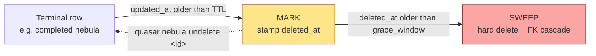

# Garbage Collection

Quasar's fabric is a single SQLite database shared across every registered repo
(see [fabric.md](fabric.md)). Left alone it grows without bound: every completed
nebula, its phases, every constellation run and its `star_invocations` and
checkpoints, every processed sensor event, every consumed trigger row, and every
content-addressed blob accumulates forever. The **garbage collector** is the
only path that hard-deletes that state.

`internal/gc/` (package doc at `internal/gc/audit.go:1`) implements a
conservative, auditable TTL-based mark-and-sweep plus two satellite reapers — one
for blobs, one for git worktrees. This document covers what it removes, when,
how to drive it, and the invariants that keep it from ever racing live work.

## Why GC exists

Without a reaper the fabric is append-mostly. A long-running fleet accumulates:

- **Completed and failed nebulas** and their `phases` children.
- **Constellation runs** and their `star_invocations`, `checkpoints`, and
  `checkpoint_files` grandchildren.
- **Sensor events** that have already been processed into nebulas.
- **Consumed `trigger_queue` rows** that have already fired their runs.
- **Blobs** — the content-addressed bodies and diffs referenced by phases and
  star invocations — that become unreferenced once their owners are deleted.
- **Git worktrees** left behind by terminal runs.

GC reclaims all of it on per-category schedules, with a recovery window before
anything is permanently lost.

## The lifecycle: mark → grace → sweep

Row categories follow a three-stage soft-delete lifecycle so an operator (or a
bug) always has a recovery window before data is gone for good.



1. **Mark** — a row whose status/state is *terminal* and whose age exceeds its
   category TTL is soft-deleted by stamping `deleted_at`
   (e.g. `internal/gc/categories.go:68`). It stays fully queryable; nothing
   cascades yet.
2. **Grace window** — the row sits soft-deleted for `grace_window` (default 24h,
   `internal/config/gc.go:65`). During this window `quasar nebula undelete`
   can restore it.
3. **Sweep** — once `deleted_at` is older than the grace window, the row is
   hard-deleted and its children are removed in the same transaction
   (`internal/gc/categories.go:79-100`). Foreign keys are enforced *in
   application code*, not by `ON DELETE CASCADE`, which is what yields the exact
   cascaded-row counts in the audit log (`internal/gc/categories.go:264`).

`trigger_queue_consumed` is the one exception: a consumed trigger has no recovery
value, so it is hard-deleted directly with no `deleted_at` and no grace window
(`internal/gc/categories.go:209-228`).

## Categories and TTLs

The six categories are the consts in `internal/gc/categories.go:13-20`. Age is
measured from `updated_at`/`completed_at`, which is bumped on the transition into
a terminal state — the nebula lifecycle has no dedicated `completed_at` column
(`internal/gc/categories.go:22-24`).

| Category | Primary table | Terminal set | Default TTL | Cascades |
|---|---|---|---|---|
| `completed_nebulas` | `nebulas` | `completed, shipped, merged, done` (`categories.go:26`) | 168h / 7d | `phases` |
| `failed_nebulas` | `nebulas` | `failed, killed, crashed, abandoned` (`categories.go:27`) | 720h / 30d | `phases` |
| `constellation_runs` | `constellation_runs` | `done, failed, killed, crashed` (`categories.go:28`) | 168h / 7d | `star_invocations`, `checkpoints`, `checkpoint_files` |
| `sensor_events` | `sensor_events` | `processed_at IS NOT NULL` (`categories.go:180`) | 720h / 30d | — |
| `trigger_queue_consumed` | `trigger_queue` | `state = 'consumed'` (`categories.go:216`) | 24h / 1d | — (no grace window) |
| `blobs` | blobstore | unreferenced (mark-and-sweep) | `min_age_before_sweep` = 1h | — |

Default TTLs are defined in `DefaultGCConfig` (`internal/config/gc.go:61-79`) and
registered as viper defaults by `setGCDefaults` (`internal/config/gc.go:83`), so
"no `[gc]` block" and "empty `[gc]` block" behave identically. The
`.quasar.yaml` block — GC is **global**, not per-repo, because the database it
reaps is the single shared store (`internal/config/gc.go:10-14`):

```yaml
gc:
  enabled: true
  tick_interval: "1h"      # background sweeper cadence
  grace_window: "24h"      # soft-delete -> hard-delete recovery window
  ttls:
    completed_nebulas: "168h"      # 7 days
    failed_nebulas: "720h"         # 30 days
    constellation_runs: "168h"     # 7 days
    sensor_events: "720h"          # 30 days
    trigger_queue_consumed: "24h"  # 1 day
    audit_log: "8760h"             # 1 year (see note below)
  blobs:
    sweep_interval: "24h"
    min_age_before_sweep: "1h"
```

`GCConfig.Validate` (`internal/config/gc.go:101`) rejects a non-positive tick
interval, a negative grace window, and negative TTLs, so a misconfiguration
cannot make the sweeper spin or delete rows the instant they land.

> **Trade-off / current limitation.** `audit_log` (`internal/config/gc.go:45`,
> default 1y at `internal/config/gc.go:72`) is a *declared retention TTL* for the
> JSONL audit file, but it is **not** one of the sweep categories in
> `categories.go` and there is no in-process log rotator today. Rotate
> `gc-audit.log` with an external tool (`logrotate`) until a rotator ships. The
> value is validated and reserved so the config surface is stable.

## The mark-and-sweep blob GC

Blobs are content-addressed and shared, so they cannot be deleted by ownership —
two phases may reference the same hash. Instead a **mark-and-sweep** in
`internal/blobstore/gc.go:43` (`Store.Sweep`) builds the live set by walking
every *registered reference column* and deletes any blob that is both
unreferenced and older than `min_age_before_sweep`.

Reference columns register themselves at package init via `RegisterReference`
(`internal/blobstore/reference.go:28`). This indirection is what keeps the live
set complete: a new blob-bearing column is invisible to the sweep until it is
registered, which would silently delete live data. An architecture test
(`TestBlobHashColumnsRegistered` in `internal/arch_test/`) closes that gap — it
fails the build if a `*_blob_hash` column in the migrations has no matching
`RegisterReference` call, and vice-versa.

The `min_age_before_sweep` floor (default 1h, `internal/config/gc.go:53-55`)
protects a just-written blob whose reference has not yet been committed from
being mistaken for garbage.

> **Safety:** the blob sweep skips *entirely* if any constellation run is in
> flight anywhere (`internal/gc/engine.go:219-233`). An active run may be about
> to write a reference whose blob would otherwise look unreferenced, so the GC
> would rather skip a pass than race it.

## The worktree reaper

Terminal runs leave behind git worktrees on `quasar/<run-id>` branches. The
reaper (`internal/gitops/worktree_reaper.go:79`, `WorktreeReaper.Reap`) reclaims
them, with two conservative guards:

- **Namespace guard.** It only ever considers worktrees whose branch is under
  `refs/heads/quasar/` (`internal/gitops/worktree_reaper.go:16`), so it can
  never touch a human's main checkout or an unrelated worktree.
- **Non-terminal guard.** The engine passes an `isProtected` callback keyed on
  the run id (`internal/gc/engine.go:258-262`); a worktree whose
  `constellation_run` is still `running`, `paused`, or `blocked_on_review`
  (`internal/gc/categories.go:31`) is never removed. A worktree is reclaimed
  only when its run row is terminal or gone.

## The audit log

Every mark, sweep, and reap appends one line to a JSONL audit log at
`.quasar/gc-audit.log` (path from `cmd/gc.go:115`). The writer is
`AuditLog.Append` (`internal/gc/audit.go:65`), mutex-guarded for concurrent use
because the blob sweep runs on its own schedule.

Each line is an `AuditEntry` (`internal/gc/audit.go:28-42`); `omitempty` keeps
lines compact by emitting only the fields relevant to the action. The action is
one of `mark`, `sweep`, `reap` (`internal/gc/audit.go:21-23`). A sample:

```json
{"ts":"2026-06-09T04:00:01Z","category":"completed_nebulas","action":"mark","nebula_id":"neb-abc","reason":"ttl_expired"}
{"ts":"2026-06-09T04:00:02Z","category":"completed_nebulas","action":"sweep","nebula_id":"neb-xyz","cascaded_phases":4}
{"ts":"2026-06-09T04:00:03Z","category":"blobs","action":"sweep","hash":"deadbeef","size_bytes":4096}
{"ts":"2026-06-09T04:00:03Z","category":"worktrees","action":"reap","repo_path":"/srv/acme","count":2,"reclaimed_bytes":1048576}
```

`ReadAuditSince` (`internal/gc/audit.go:88`) tails the file, skipping malformed
lines so a crash mid-write never blocks a read. As noted above, the file is **not
rotated in-process** today.

## The `gc_runs` ledger

Where the JSONL log records one line per *decision*, the `gc_runs` table records
one row per *sweep pass per category* — the aggregate trend. `recordRun`
(`internal/gc/engine.go:287`) inserts a row after each category and each blob
pass (`internal/gc/engine.go:207`, `internal/gc/engine.go:247`):

```sql
INSERT INTO gc_runs (started_at, completed_at, category, swept_count, reclaimed_bytes, error)
VALUES (?, ?, ?, ?, ?, ?)
```

A failing category still records a row with its `error` set, so a recurring sweep
failure is visible in the ledger even though `recordRun` never aborts the pass
(`internal/gc/engine.go:285-286`). The 2026-06-08 audit extended
`quasar gc audit` to summarize this table alongside the JSONL tail
(`cmd/gc.go:185`, `printGCRunsSummary` at `cmd/gc.go:196`).

## CLI surface

All GC commands are one-shot operations over the shared fabric DB; the wiring is
in `cmd/gc.go`. See [cli.md](cli.md#quasar-gc) for the full flag reference.

| Command | What it does | Flags |
|---|---|---|
| `quasar gc run` | One full pass: row categories, then blobs, then worktrees (`cmd/gc.go:118`). | `--dry-run`, `--category <name>` |
| `quasar gc blobs` | The blob mark-and-sweep only (`cmd/gc.go:140`). | `--dry-run` |
| `quasar gc audit --since 24h` | Tail the JSONL log and print the `gc_runs` summary for the window (`cmd/gc.go:156`). | `--since <dur>` (default 24h) |
| `quasar nebula undelete <id>` | Restore a soft-deleted nebula within its grace window (`cmd/nebula_undelete.go:18`). | — |

`--dry-run` reports what *would* be deleted without mutating anything: the count
queries run instead of the mutations (`internal/gc/categories.go:324`), and no
`gc_runs` row is written (`internal/gc/engine.go:206`). `--category` restricts a
`gc run` to a single category and errors on an unknown name
(`internal/gc/engine.go:213-214`).

## Safety: never GC during active work

The engine is built to skip rather than race:

- **Blob sweep** skips the entire pass if any run is in flight
  (`internal/gc/engine.go:226-233`).
- **Constellation runs** belonging to a repo that currently has any non-terminal
  run are skipped — the per-repo "never GC while that repo's runtime is busy"
  rule (`internal/gc/categories.go:114-122`).
- **Nebulas** with a non-terminal constellation run are never marked
  (`internal/gc/categories.go:55-57`), so the GC can never reap a nebula the
  runtime still touches.
- **Worktrees** of non-terminal runs are protected (see above).

The cost of these guards is that a perpetually-busy repo's terminal rows linger
until it goes idle — GC favors safety over promptness.

## Operational pattern

A typical always-on deployment:

- Leave the **background row sweeper** enabled (`gc.enabled: true`,
  `tick_interval: 1h`); it is cheap and keeps the row tables trimmed.
- Let the **blob sweep** run on its slower `sweep_interval` (24h). Because it
  skips while runs are active, it naturally lands during idle windows; an
  overnight `quasar gc blobs` is a good belt-and-suspenders pass for a busy fleet
  that is rarely fully idle.
- **Rotate `gc-audit.log` externally** (e.g. nightly `logrotate`) until an
  in-process rotator ships.
- Run `quasar gc run --dry-run` after changing any TTL to preview the blast
  radius before the next live pass.

See also: [safety.md](safety.md#audit-trail) for the full set of audit logs,
[fabric.md](fabric.md) for the schema GC reaps, and [cli.md](cli.md) for command
details.
