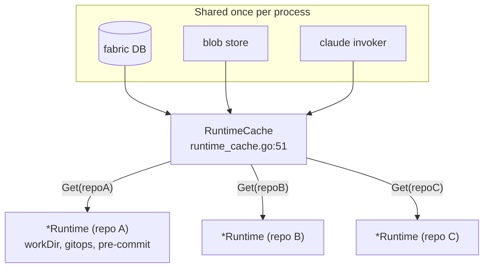
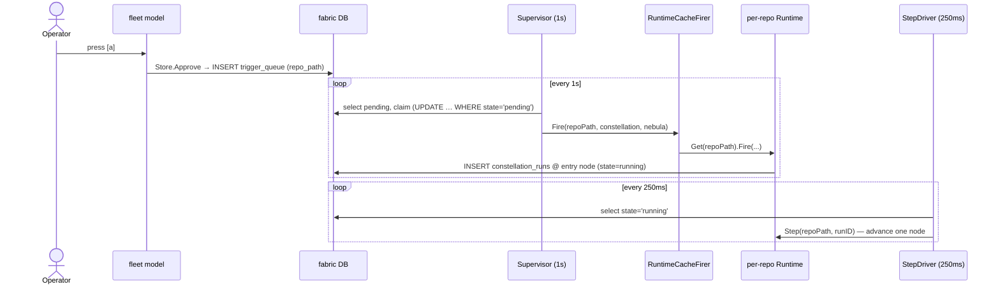

# Multi-repo

One Quasar process can serve **many repositories at once**. The fleet dashboard
shows every registered repo's work side by side; the trigger supervisor fires
approved nebulas against the correct per-repo runtime; a runtime cache keeps one
`*Runtime` per repo, sharing the expensive global resources (the fabric DB, the
blob store, the Claude invoker) while deriving the cheap per-repo bits
(working directory, git client, pre-commit policy) lazily.

> `file:line` citations were verified against `main` at write time and may drift
> as the code changes.

Related reading: [fabric.md](fabric.md) (the shared DB), [runtime.md](runtime.md)
(Fire/Step), [per-repo-config.md](per-repo-config.md) (a repo's override dirs),
[deployment.md](deployment.md) (running it as a service), and the
[architecture overview](architecture.md).

## 1. The multi-repo model

Each registered repo has its own `.quasar.yaml`, its own working directory, and
its own per-repo override files (`constellations/`, `stars/`, `skills/`,
`sensors/`). What is **shared** across all repos in one process:

- the fabric SQLite database,
- the content-addressed blob store,
- the Claude CLI invoker.

These three are constructed once and threaded into every per-repo runtime (see
§6). Everything else is per-repo.



## 2. Repo registration

Registration is **explicit — there is no auto-discovery** (`cmd/repo.go:3-5`).
`quasar repo register <path>` adds a row to the `repos` table.

The command tree is built by `newRepoCmd` (`cmd/repo.go:25`); the `register`
subcommand is wired at `cmd/repo.go:37-43` with handler `runRepoRegister`
(`cmd/repo.go:115`). The handler opens the registry (`openRegistry`,
`cmd/repo.go:94`) and calls `Registry.Register`.

`Registry` (`internal/repos/registry.go:23`) owns CRUD over the `repos` table.
`Register` (`internal/repos/registry.go:39`) validates the path (must exist, be
a directory, contain a `.git` entry, be readable — `validateRepoPath`,
`registry.go:256`), resolves it to absolute, defaults the name to the directory
base, then inserts:

```sql
INSERT INTO repos (path, name, status, added_at, updated_at, last_seen_at)
VALUES (?, ?, ?, ?, ?, ?)
ON CONFLICT(path) DO NOTHING
```

(`internal/repos/registry.go:49-52`). An `ON CONFLICT … DO NOTHING` that affects
zero rows is reported as `ErrRepoAlreadyRegistered` (`registry.go:60-62`).
Related lifecycle operations live alongside it: `Unregister` (soft-delete +
orphan in-flight nebulas, `registry.go:72`), `List` (`:116`), `SetStatus`
(pause/resume, `:160`), and `Touch` (`:173`).

## 3. The repos.Resolver

Once a repo is registered, the artifact loader must know whether to use the
repo's *override* file for a constellation/star/skill or fall back to the
embedded default. That decision is the `Resolver`'s job
(`internal/repos/resolver.go:38`), built by `NewResolver`
(`internal/repos/resolver.go:48`), which also loads the repo's `.quasar.yaml`
(or the built-in defaults if absent, `resolver.go:63-70`).

The lookup is "override wins, else embedded": `ConstellationPath`
(`resolver.go:93`), `StarPath` (`:98`), and `SkillPath` (`:103`) all delegate to
`overrideOrEmbedded` (`resolver.go:142`), which returns the per-repo path
`<repo>/<dir>/<name>.<ext>` when it exists, otherwise the sentinel `EmbeddedPath`
(`":embedded:"`, `resolver.go:15`).

The artifact loader consumes this. `Loader.LoadConstellation`
(`internal/artifacts/loader.go:157`) calls `l.resolver.ConstellationPath(name)`
(`loader.go:158`) and hands the result to its reader, which resolves
`EmbeddedPath` against the embedded FS. So a repo with no
`constellations/coder-reviewer.toml` transparently gets the built-in one;
dropping that file in the repo overrides it. (Sensors differ: they have **no**
embedded default — `SensorPath` returns `ErrSensorNotConfigured`,
`resolver.go:109`. See [sensors.md](sensors.md).)

## 4. The fleet view

`quasar fleet` (alias `tui`, `cmd/fleet.go:42-51`) opens a three-lane dashboard
grouped by registered repo. The lanes, in display order
(`internal/tui/fleet/render.go:9`), are **Awaiting Approval**, **In Flight**, and
**Recent**. The package reads *exclusively* from the fabric DB — it never imports
the runtime or sensor packages (`internal/tui/fleet/fleet.go:1-8`), which keeps
it robust to runtime restarts.

State is one `RepoLane` per repo (`fleet.go:34`), each holding the three lanes'
cards plus a `Folded` flag. Each lane is a fabric query keyed by `repo_path`:

| Lane | `Store` method | Query (file:line) |
|------|----------------|-------------------|
| Awaiting Approval | `awaiting` (`fleet.go:167`) | `nebulas WHERE repo_path = ? AND status = 'awaiting_approval' AND gc_at IS NULL` (`fleet.go:168-172`) |
| In Flight | `inFlight` (`fleet.go:194`) | `constellation_runs JOIN nebulas … WHERE n.repo_path = ? AND r.state IN ('running','paused','blocked_on_review')` (`fleet.go:195-201`) |
| Recent | `recent` (`fleet.go:177`) | `nebulas WHERE repo_path = ? AND status IN (<terminal>) … LIMIT 10` (`fleet.go:178-183`) |

`Store.Load` populates all three lanes per repo (`fleet.go:104`); the background
2-second tick uses `LoadInFlight` (`fleet.go:129`) so it touches *only* the
`constellation_runs` query, keeping idle churn bounded as the repo count grows.
`RenderFleet` lays the repos out row-wise so a repo's three lanes line up
horizontally (`render.go:46`). Folding is toggled by the `f` key
(`internal/tui/fleet/model.go:247-248`).

## 5. The supervisor in the fleet

The fleet dashboard would be inert without something to consume approvals.
`runFleet` (`cmd/fleet.go:59`) starts that consumer via `startTriggerSupervisor`
(`cmd/fleet.go:108`) before opening the Bubble Tea program.

`startTriggerSupervisor` builds, in order:

1. config (`config.Load`, `cmd/fleet.go:109`),
2. the shared blob store (`cmd/fleet.go:114`),
3. the shared Claude invoker, validated (`cmd/fleet.go:119-122`),
4. a `RuntimeCache` over those shared deps (`cmd/fleet.go:124-133`),
5. a `Supervisor` wired to a `RuntimeCacheFirer` (`cmd/fleet.go:136-140`),
6. a `StepDriver` wired to a `RuntimeCacheStepper` (`cmd/fleet.go:146-150`),
7. a single goroutine that runs both loops until ctx cancellation, then closes
   the shared log handle (`cmd/fleet.go:151-168`).

Construction is **best-effort**: if Claude or the blob store is unavailable, the
error is returned, `runFleet` prints one stderr line, and the dashboard still
opens with the supervisor disabled (`cmd/fleet.go:85-87`).

### Diagnostic-log routing

The supervisor and step driver must **not** write to stderr: that would corrupt
the Bubble Tea altscreen. `openSupervisorLog` (`cmd/fleet.go:175`) opens an
append-mode file *alongside the fabric DB* —
`filepath.Join(filepath.Dir(dbPath), "supervisor.log")` (`cmd/fleet.go:176`),
i.e. `.quasar/supervisor.log` for the default DB path. A failure to open it
routes diagnostics to `io.Discard` rather than stderr (`cmd/fleet.go:177-181`).
Tail that file to watch what the consumer is doing during a TUI session.

The two loops run at different cadences (`cmd/fleet.go:29`, `:37`):

| Loop | Interval | Why |
|------|----------|-----|
| `Supervisor` | 1 s (`triggerSupervisorInterval`) | balances approval latency against DB churn on the cheap pending-row query |
| `StepDriver` | 250 ms (`stepDriverInterval`) | `Step` is the hot path — every node firing, every cycle, every nested dispatch |

## 6. The RuntimeCache

`RuntimeCache` (`internal/constellations/runtime_cache.go:51`) lazily constructs
and caches one `*Runtime` per repo path. It is the bridge between the
supervisor's single `Firer` and the per-repo binding a `*Runtime` requires
(working dir, gitops client, pre-commit policy).

- **Shared vs per-repo deps:** `RuntimeCacheOpts` (`runtime_cache.go:25`) carries
  the shared `DB`, `Blobs`, `Invoker`, and a `DefaultBudgetUSD`; the shared
  stores (`runStore`, `nebStore`, `entStore`) are built once in
  `NewRuntimeCache` (`runtime_cache.go:73-79`). Per-repo deps — the
  `repos.Resolver`, the `artifacts.Loader`, the gitops `Client`, and the
  pre-commit policy — are derived inside `Get` (`runtime_cache.go:101-128`).
- **Lazy construction, mutex-guarded:** `Get` (`runtime_cache.go:86`) resolves
  the path to absolute, then under a mutex returns the cached `*Runtime` or
  builds one and stores it (`runtime_cache.go:95-130`).
- **No memoization of failures:** a construction failure is returned, **not**
  cached (`runtime_cache.go:49-50`), so a transient config-load error does not
  kill the repo for the whole session — the next `Get` retries. A pre-commit
  lookup error degrades to an empty policy rather than failing the whole repo
  (`runtime_cache.go:108-116`).

Per-repo isolation is covered by `TestRuntimeCachePerRepoIsolation`
(`internal/constellations/runtime_cache_test.go:89`), alongside tests for
required-DB validation (`:52`), empty-path rejection (`:64`), success
memoization (`:72`), per-repo `PreCommitFor` invocation (`:108`), and firer
routing (`:142`).

## 7. The Firer (and Stepper) interfaces

The supervisor talks to the runtime through a narrow seam so it can be tested
with a fake and so single-repo and multi-repo callers share one code path.

`Firer` (`internal/constellations/supervisor.go:25`) has one method,
`Fire(ctx, repoPath, constellationName, nebulaID)`. Two implementations:

- `SingleRepoFirer` (`supervisor.go:32`) wraps one `*Runtime` and ignores
  `repoPath` — for tests and single-repo deployments (`supervisor.go:40`).
- `RuntimeCacheFirer` (`internal/constellations/runtime_cache.go:137`) resolves
  the per-repo `*Runtime` via `cache.Get(repoPath)` and dispatches
  (`runtime_cache.go:144-150`) — the multi-repo production path.

The step driver mirrors this exactly with the `Stepper` interface
(`internal/constellations/step_driver.go:27`), `SingleRepoStepper`
(`step_driver.go:33`), and `RuntimeCacheStepper` (`step_driver.go:45`).

## 8. End-to-end approval flow



Step by step, with citations:

1. **Operator presses `[a]`** in the fleet view. The key handler calls
   `m.approve(false)` (`internal/tui/fleet/model.go:249-250`).
2. **`Store.Approve`** (`internal/tui/fleet/fleet.go:330`) flips the nebula to
   `approved` and, in the same transaction, inserts a `trigger_queue` row
   carrying the nebula's `repo_path`
   (`fleet.go:344-348`) — so the consumer can route by repo without a join.
3. **Within ~1 s, `Supervisor.Tick`** (`internal/constellations/supervisor.go:80`)
   reads pending rows oldest-first via `selectPending`
   (`supervisor.go:142-152`), which selects `COALESCE(repo_path, '')`.
4. **Claim, then Fire.** `claim` runs
   `UPDATE trigger_queue SET state='consumed' WHERE id=? AND state='pending'`
   (`supervisor.go:172-173`); winning the row, the supervisor calls
   `Firer.Fire(ctx, t.RepoPath, …)` (`supervisor.go:101`). The claim precedes
   Fire so a crash between them is auditable (consumed-without-run) rather than a
   double-fire (`supervisor.go:74-79`).
5. **`RuntimeCacheFirer.Fire`** (`runtime_cache.go:144`) resolves the per-repo
   `*Runtime` via `cache.Get(repoPath)` and calls `rt.Fire(...)`
   (`runtime_cache.go:145-149`).
6. **`Runtime.Fire`** (`internal/constellations/runtime.go:164`) snapshots the
   constellation, builds initial state, and inserts a `constellation_runs` row
   positioned at the **entry node** in state `running`
   (`runtime.go:187-196`).
7. **`StepDriver` advances the run.** `Runtime.Fire` only *creates* the run; its
   own doc-comment is explicit that "execution is asynchronous: the supervisor
   drives Step until the run is terminal" (`runtime.go:158-161`). The driver is
   `StepDriver.Tick` (`internal/constellations/step_driver.go:90`), which selects
   `state='running'` rows oldest-heartbeat-first (`selectRunning`,
   `step_driver.go:146-157`) and calls `Stepper.Step(repoPath, runID)` on each
   (`step_driver.go:102`).

### A note on the historical "Step-driver gap"

Earlier design notes (and the original form of this phase's spec) assumed a
**gap**: that the supervisor only *fires* a run and nothing advances it, leaving
it parked at the entry node forever. That gap was real — and **it has since been
closed**. The supervisor still does *not* advance runs (by design — it only
initiates), but a separate `StepDriver` loop now does. `StepDriver`'s own
doc-comment records the history: *"Without it, runs fired by the Supervisor stall
at their entry node … nothing else called Step from production code before this
driver shipped"* (`internal/constellations/step_driver.go:58-61`).

The two loops are started together in `startTriggerSupervisor`
(`cmd/fleet.go:146-163`). So the honest current picture is a **two-loop split**:

- the **Supervisor** turns approvals into runs (the consumer of `trigger_queue`),
- the **StepDriver** walks running runs to terminal (the driver of `Step`).

If you are extending this, note the wiring lives entirely in `cmd/fleet.go`
today — it is bound to the *fleet dashboard's* lifetime. Running the trigger
pipeline as a headless always-on service (no TUI) would mean lifting that
construction sequence out of `cmd/fleet.go` into a standalone daemon command;
that command does not yet exist. See [deployment.md](deployment.md) for the
service model this would slot into.

## See also

- [runtime.md](runtime.md) — Fire, Step, back-edges, and the runtime internals
  the cache hands out.
- [fabric.md](fabric.md) — the shared schema: `repos`, `nebulas`,
  `trigger_queue`, `constellation_runs`.
- [entanglements.md](entanglements.md) — cross-phase coordination, also keyed off
  the shared DB.
- [conflict-resolution.md](conflict-resolution.md) — what happens when parallel
  runs in one repo collide at merge time.
- [per-repo-config.md](per-repo-config.md) — the override directories the
  resolver reads.
- [audit-2026-06-08.md](audit-2026-06-08.md) — Gap A, the `trigger_queue`
  consumer that became the Supervisor.
