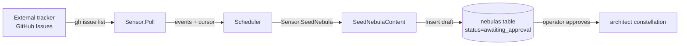

# Sensors

A **sensor** is how external work gets *into* Quasar. It is a poll-driven
adapter: a scheduler queries it on an interval, the sensor returns a batch of
events plus an advanced cursor, and the runtime renders each event into a *seed
nebula* — a draft row in the `nebulas` table — that an operator approves to kick
off the architect constellation.

This document is the conceptual model. For the step-by-step recipe to write your
own sensor, see [sensor-authoring.md](sensor-authoring.md). For where a seed
nebula goes after approval, see [architecture.md](architecture.md) and
[runtime.md](runtime.md). For the SQLite tables named below, see
[fabric.md](fabric.md).

> All `file:line` citations were verified against `main` at write time and may
> drift as the code changes.

## Contents

1. [What a sensor is](#1-what-a-sensor-is)
2. [The Sensor interface](#2-the-sensor-interface)
3. [Event and SeedNebulaContent](#3-event-and-seednebulacontent)
4. [The cursor contract](#4-the-cursor-contract)
5. [The dedup contract](#5-the-dedup-contract)
6. [The scheduler](#6-the-scheduler)
7. [The GitHub sensor](#7-the-github-sensor)
8. [Status — what is wired today](#8-status--what-is-wired-today)
9. [The token-resolution chain](#9-the-token-resolution-chain)
10. [Per-repo sensor TOML format](#10-per-repo-sensor-toml-format)

---

## 1. What a sensor is

A sensor does **not** push. Nothing calls into Quasar from the outside; instead a
scheduler goroutine *polls* the sensor on its configured interval. Each poll
returns a slice of `Event` values and an updated, opaque cursor. The runtime then
asks the sensor to render each new event into a `SeedNebulaContent`, and writes
that as a draft row in the `nebulas` table with status `awaiting_approval`
(`internal/sensors/scheduler.go:16`).

A seed nebula carries a source block (where it came from), basic context (goals
and constraints derived from the source item), but **no phases**. It is a draft.
The architect constellation refines an approved seed into executable phases — the
sensor's only job is to manufacture good drafts
(`internal/sensors/sensors.go:81-91`).



The poll-driven shape is deliberate: a sensor is a pure function of *(cursor,
external state) → (events, new cursor)* with no durable state of its own. The
runtime owns persistence (cursor, dedup, draft rows), so a sensor implementation
stays small and is trivially testable.

## 2. The Sensor interface

The contract lives in `internal/sensors/sensors.go:92-112`. Four methods:

| Method | Citation | Responsibility |
|--------|----------|----------------|
| `Name() string` | `sensors.go:95` | Returns the sensor *type* name (e.g. `"github_issues"`). This is the registry key, and what a repo's sensor TOML `type = "..."` matches. |
| `Configure(raw map[string]any, secrets SecretResolver) error` | `sensors.go:100` | Parses the instance's `[config]` block and resolves secrets. Returns a typed error so `quasar lint` can surface misconfiguration before the supervisor boots. |
| `Poll(ctx, cursor json.RawMessage) ([]Event, json.RawMessage, error)` | `sensors.go:106` | Returns events since the cursor plus an advanced cursor. An empty cursor means "first poll". The runtime persists `newCursor` for you. |
| `SeedNebula(event Event) (*SeedNebulaContent, error)` | `sensors.go:111` | Renders one event into the structured content the runtime writes to SQLite. The sensor never touches the database itself. |

```go
type Sensor interface {
    Name() string
    Configure(raw map[string]any, secrets SecretResolver) error
    Poll(ctx context.Context, cursor json.RawMessage) (events []Event, newCursor json.RawMessage, err error)
    SeedNebula(event Event) (*SeedNebulaContent, error)
}
```

Implementations live in their own subpackage of `internal/sensors/` and register
a constructor with the process registry from `init()`
(`internal/sensors/sensors.go:81-84`). Implementations **must** be safe for
concurrent use — the supervisor runs one scheduler goroutine per sensor instance
(`sensors.go:90-91`).

There is also a write-side `Forge` interface (`sensors.go:119-122`), reserved
with only `Name()` today; the full PR/comment/status surface lands in a later
nebula. It is mentioned here only so the registry's two namespaces
(`internal/sensors/registry.go:22-26`) make sense — `"github"` legitimately
names both a forge and a sensor type.

## 3. Event and SeedNebulaContent

These are the two typed payloads a sensor produces.

**`Event`** (`internal/sensors/sensors.go:60-64`) is one observed unit of work:

```go
type Event struct {
    ExternalID string         // sensor-defined, unique per source
    Timestamp  time.Time
    Raw        map[string]any // adapter-internal payload
}
```

`ExternalID` is the dedup identity (see §5). `Raw` carries whatever the adapter
needs to later render the seed — it is *not* persisted, so it must be
reconstructable from a re-poll (this is why crash recovery re-fetches rather than
reads from a stored payload; see §6).

**`SeedNebulaContent`** (`internal/sensors/sensors.go:69-79`) is what `SeedNebula`
returns for one event:

```go
type SeedNebulaContent struct {
    Name        string
    Description string
    SourceName  string
    SourceID    string
    SourceURL   string
    Goals       []string
    Constraints []string
    Labels      []string
    Assignee    string
}
```

The runtime maps this onto the scheduler's package-local `SeedNebula` struct
(`scheduler.go:59-76`) and hands it to a `NebulaInserter`
(`scheduler.go:79-81`). The `Goals` and `Constraints` are rendered into the
nebula's `[context]` block so the architect that later refines the seed inherits
them as repo context (see the `seedNebulaInserter` adapter in
`cmd/sensor.go:146-161`).

## 4. The cursor contract

A cursor is **opaque JSON**, defined entirely by the sensor for itself. The
runtime never inspects it — it only stores and replays it.

- The sensor returns `newCursor` from `Poll`; the scheduler persists it via the
  `CursorStore` interface (`scheduler.go:37-40`), backed by the `sensor_cursors`
  table (`internal/fabric/sensor_store.go:15-60`).
- An empty/`null` cursor means "first poll" — the sensor starts from the
  beginning (`sensors.go:104-105`).
- The cursor must advance **monotonically** so re-polling never re-emits work
  already turned into a seed. Two shipped shapes:
  - **Numeric counter** — the GitHub sensor stores the highest issue number
    seen (`github/github.go:114-118`, the `last_issue_number` field).
  - **Timestamp** — a `last_updated_at` watermark (used by the specced, not yet
    shipped, Linear sensor; see §8).

The `sensor_cursors` row is keyed by `(repo_path, sensor_name)`
(`005_sensor_state.sql:19-25`), so each sensor instance on each repo carries its
own independent cursor. A nil cursor round-trips losslessly: `Set` stores it as
an empty blob, `Get` maps the empty blob back to `nil`
(`sensor_store.go:27-60`).

## 5. The dedup contract

Cursors give *forward* progress; the dedup table gives *exactly-once* seeding
even across a crash. The mechanism is a single UNIQUE constraint
(`internal/fabric/migrations/005_sensor_state.sql:27-36`):

```sql
CREATE TABLE sensor_events (
  id           INTEGER PRIMARY KEY AUTOINCREMENT,
  repo_path    TEXT NOT NULL REFERENCES repos(path) ON DELETE CASCADE,
  sensor_name  TEXT NOT NULL,
  external_id  TEXT NOT NULL,
  received_at  INTEGER NOT NULL,
  processed_at INTEGER,
  nebula_id    TEXT REFERENCES nebulas(id) ON DELETE SET NULL,
  UNIQUE (repo_path, sensor_name, external_id)
);
```

Every observed event is recorded with `INSERT OR IGNORE`
(`internal/fabric/sensor_store.go:91-118`). A re-observed `external_id` collides
with the UNIQUE constraint, the INSERT becomes a no-op (`isNew=false`), and the
scheduler skips re-seeding it (`scheduler.go:261-263`).

This is **why `ExternalID` must be stable across polls.** A numeric issue id
(`papapumpkin/quasar#42`) is stable; a poll-time timestamp or an array index into
a paginated response is not — those would re-seed the same work or skip new work.
The anti-patterns are spelled out in
[sensor-authoring.md](sensor-authoring.md#3-designing-an-externalid).

## 6. The scheduler

`internal/sensors/scheduler.go` drives one sensor instance. There is one
`Scheduler` per `(repo_path, sensor_name)` tuple (`scheduler.go:98-101`). The
loop (`Run`, `scheduler.go:180-198`) polls immediately, then on every
`poll_interval` tick; a failed poll is logged and the loop continues so a
transient outage cannot kill the scheduler.

One cycle is `PollOnce` (`scheduler.go:223-290`):

1. Load the cursor and the set of **orphans** — events recorded but never seeded,
   left by a tick that crashed mid-batch (`scheduler.go:224-236`).
2. `Poll` the sensor under a bounded timeout (`scheduler.go:238-243`; default 60s,
   `scheduler.go:24`).
3. For each event: `Insert` into `sensor_events` (the dedup gate), then seed it
   **iff** it is brand-new (`isNew`) or a known orphan; a duplicate from a
   completed earlier tick is skipped (`scheduler.go:252-275`).
4. Advance the cursor **only after** the whole batch is durably seeded
   (`scheduler.go:278-281`).
5. Fire each seeded nebula's triggers under a per-`(repo, sensor)` in-flight cap
   (`scheduler.go:283-287`, `dispatch` at `scheduler.go:328-350`).

The crash-safety invariant is the ordering in steps 3–4: record-before-seed and
advance-cursor-after-batch. A crash anywhere mid-batch leaves the cursor
unadvanced; the next `Poll` re-fetches the same items (with their `Raw` payload,
which the event row does not store), and the orphan set tells the scheduler which
to re-seed versus skip (`scheduler.go:212-222`).

**The scheduler does not enqueue `trigger_queue` rows itself today.** The
`TriggerFunc` is injected (`scheduler.go:32-34`), and the production
implementation that enqueues a `trigger_queue` row for the runtime to consume is
explicitly deferred ("Phase 5 supplies the production implementation"). See §8.

## 7. The GitHub sensor

The one shipped sensor is `internal/sensors/github/`. It is **read-only**: it
shells out to `gh` solely to list and read issues, and never performs a git write
— those belong to `internal/gitops/` (`github/github.go:33-36`). The registry key
is `github_issues`; the `_issues` suffix leaves room for a future `github_prs`
sensor type (`github/github.go:17-19`).

### Configure (`github/github.go:82-112`)

1. Verify `gh` is on `PATH`; a missing binary yields a `*GHNotInstalledError`
   (`github.go:86-88`).
2. Read `repo` from the config block (an `"owner/repo"` slug), falling back to
   parsing `./.git/config` when absent (`github.go:90-96`,
   `detectRepoFromGitConfig` at `github.go:397-411`). An undetectable repo is
   only an error at Poll time, not Configure time.
3. Resolve the token via the `token_file > token_env > gh-fallback` precedence
   (`github.go:98-104`; see §9). An empty token defers to gh's own credential
   chain.
4. Store the label and assignee filters and wire the `gh` shell-out hook
   (`github.go:106-111`).

### Poll (`github/github.go:124-179`)

1. Decode the cursor into a last-issue-number; empty/`null` ⇒ 0 ("first poll")
   (`decodeCursor`, `github.go:267-276`).
2. Shell out to `gh issue list --repo <r> --state open --limit 100 --json ...`,
   narrowing server-side by label/assignee when configured (`listArgs`,
   `github.go:210-224`; `pollLimit = 100` at `github.go:28`).
3. For each returned issue with `number > cursor` that passes the client-side
   filter re-check (`matchesFilters`, `github.go:232-245`), emit an `Event` whose
   `ExternalID` is `"<owner>/<repo>#<number>"` and whose `Raw` carries the issue
   fields (`github.go:147-172`).
4. Advance the cursor to the highest number seen and encode it
   (`encodeCursor`, `github.go:279-285`).

The cursor is monotonic by construction (`highest` only ever climbs), so
re-polling never re-emits issues already turned into seed nebulas
(`github.go:120-123`). Server-side narrowing keeps the response small; the
client-side re-check means the cursor logic never depends on `gh` honoring a flag
(`github.go:206-209`).

### SeedNebula (`github/github.go:184-204`)

Stamps the provenance — `SourceName = "github"`, `SourceID = "<owner>/<repo>#<n>"`
— and derives goals/constraints from the issue body via
`deriveGoalsAndConstraints` (`github.go:287-317`): bullet lines under a heading
containing "constraint" or "acceptance" become **constraints**; every other
bullet becomes a **goal**; if no bullets yield goals, the issue title is used as
the single goal so a seed always carries at least one. Task-list checkboxes
(`- [ ]`) are stripped (`bulletText`, `github.go:321-333`).

### How it is tested

The `gh` shell-out is an injectable `runGHFunc` field on `Source`
(`github/exec.go:13-17`), so tests substitute a fake without invoking the real
binary. `fakeListGH` (`github/github_test.go:39-49`) answers `issue list` from a
fixture and rejects any other call; the fixture is
`internal/sensors/github/testdata/gh-issue-list.json`, loaded by `readFixture`
(`github_test.go:72-79`). This `runGH`-substitution pattern — not a shared test
kit — is the template the authoring guide recommends
([sensor-authoring.md](sensor-authoring.md#4-testing-with-an-injected-io-seam)).

## 8. Status — what is wired today

Being precise about the gap between what ships and what is specced:

- **Shipped:** the `github_issues` sensor, the `Sensor`/`Forge` interfaces, the
  registry, the secret resolver, the scheduler, and the `sensor_cursors` /
  `sensor_events` tables. You can force a single poll cycle today with the hidden
  admin command `quasar sensor poll <repo> <sensor>` (`cmd/sensor.go:30-44`).
- **Specced, not shipped:** Linear, Slack-mention, and cron sensors. These exist
  only as a nebula spec — see
  [`.nebulas/additional-sensors/`](../.nebulas/additional-sensors/) — and are
  **not** registered in the binary. No code claims them. The proposed shared
  `PollHarness` test kit in that spec likewise does **not** exist yet; today the
  template is the GitHub sensor's `runGH`-substitution pattern (§7).
- **Scheduler not auto-started.** `sensors.NewScheduler` and `PollOnce` are
  invoked only by the `quasar sensor poll` debug command (`cmd/sensor.go:121` and
  `cmd/sensor.go:80`). Nothing starts the scheduler's long-running `Run` loop —
  the fleet view (`internal/tui/fleet/`) does not boot it, and the supervisor
  (`internal/constellations/supervisor.go`) consumes `trigger_queue` rows but
  does not yet *drive* the scheduler. The `quasar sensor poll` path also injects a
  **nil** `Trigger` (`cmd/sensor.go:89-93`), so today a poll seeds drafts but
  launches no constellation.
- **Where the wiring should land.** A future supervisor phase should: load every
  instance via `Loader.LoadAllSensorInstances` (`internal/artifacts/loader.go:228-246`),
  build and configure each sensor, start one `Scheduler.Run` goroutine per
  `(repo, sensor)`, and supply a production `TriggerFunc` that enqueues a
  `trigger_queue` row (the deferred work flagged at `scheduler.go:32-34`).
- Sensor TOML files are loaded by `quasar lint` (`internal/artifacts/lint.go:78`,
  `lintSensor` at `lint.go:132`) but not yet by the fleet view's
  auto-discovery — linting validates the config; nothing yet acts on it
  automatically.

## 9. The token-resolution chain

A sensor never reads a token from config directly; it resolves a `SecretSpec`
through the injected `SecretResolver` (`internal/sensors/secret.go:39-54`). The
precedence is **file > env > empty** (`ResolveSecret`, `secret.go:56-82`):

1. `token_file` — a filesystem path (Docker `--secret` mount, systemd
   `LoadCredential`). On Unix the file **must** be mode `0600` or `0400`; looser
   permissions are a `*SecretLooseError` (`secret.go:84-105`,
   `allowedSecretModes` at `secret.go:13-16`).
2. `token_env` — an environment variable name (12-factor).
3. Empty — the adapter may fall back to its own auth. The GitHub sensor passes an
   empty token to `gh`, which then resolves its own credential chain
   (`github/exec.go:37-46`).

A configured-but-broken `token_file` is a **terminal error** — there is no silent
fallback to the environment, so a misconfigured container fails loudly rather
than masking the exact permission problem the check exists to surface
(`secret.go:67-71`).

Inline secrets are forbidden: a literal `token:` in `.quasar.yaml` is a
config-load error (see [per-repo-config.md](per-repo-config.md) and
[safety.md](safety.md#token-scopes)). The `<key>_ssm` form is reserved for the
SSM resolver specced in the deployment-cookbook nebula and is **not** shipped.

## 10. Per-repo sensor TOML format

A repo declares sensors in `<repo>/sensors/<name>.toml`, one file per instance.
The decode target is `sensorFile` (`internal/artifacts/loader_health.go:29-40`):
the `name`, `type`, `poll_interval`, and `max_inflight` keys are top-level, the
sensor's own keys live in `[config]` (opaque — the loader does not validate it
against any schema, `internal/artifacts/types.go:167-178`), and triggers are a
`[[triggers]]` array.

```toml
# sensors/github-issues.toml
name          = "github-issues"
type          = "github_issues"   # a built-in, Go-registered sensor type
poll_interval = "5m"
max_inflight  = 4                  # 0 = scheduler default (4)

[config]
repo      = "papapumpkin/quasar"   # "owner/repo"; auto-detected from .git/config if omitted
labels    = ["quasar"]             # only ingest issues carrying every listed label
assignee  = ""                     # optional; "@me"/"@none" are gh-resolved tokens
token_env = "QUASAR_GH_TOKEN"      # never inline the token; or token_file = "/run/secrets/gh"

[[triggers]]
constellation = "architect"        # what an approved seed launches
when          = "new_item"         # the only matched condition today (scheduler.go:361-365)
```

Each poll that finds a new matching issue writes a seed nebula that surfaces in
the TUI as an `awaiting_approval` draft. See
[per-repo-config.md](per-repo-config.md) for the surrounding `.quasar.yaml`,
`stars/`, `skills/`, and `constellations/` directories, and
[sensor-authoring.md](sensor-authoring.md) for writing a new sensor type.
